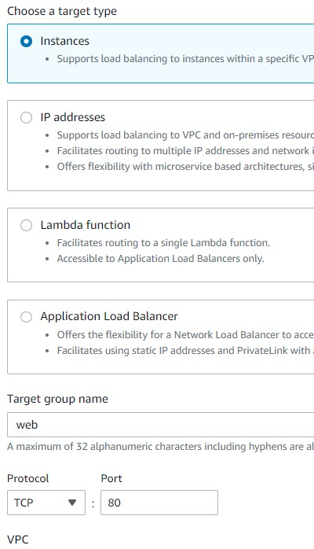
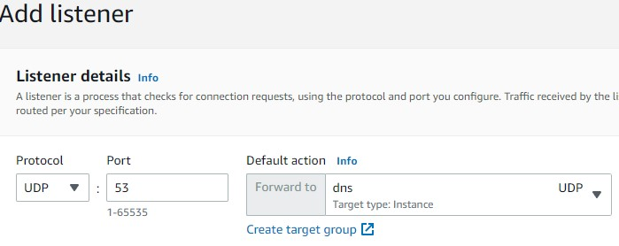
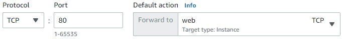
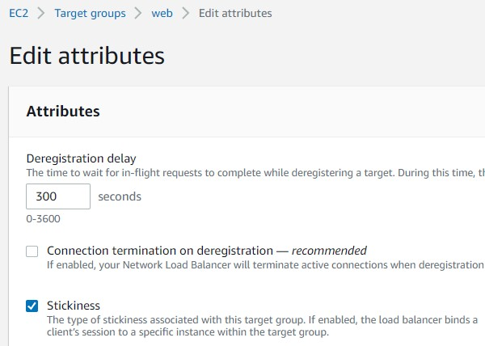
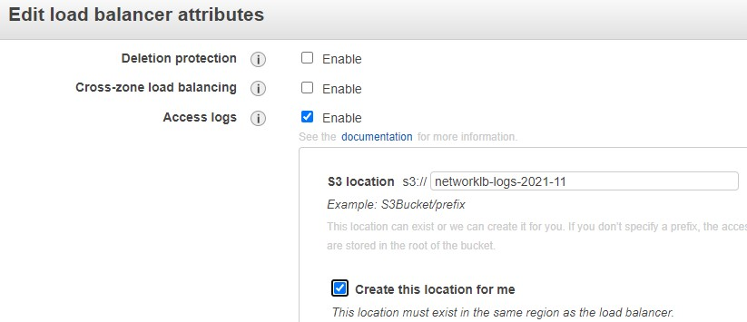

 

  
  <h3 align="center">100 days in Cloud</h3>

    ELB Network Load Balancer Challenge
     
    Lab 54
     
  

  
<h2 style="display: inline-block">Lab Details</h2>

  <ol>
    <li><a href="#services-covered">Services covered</a>
    <li><a href="#lab-description">Lab description</a></li>
    </li>
    <li><a href="#lab-date">Lab date</a></li>
    <li><a href="#prerequisites">Prerequisites</a></li>    
    <li><a href="#lab-steps">Lab steps</a></li>
    <li><a href="#lab-files">Lab files</a></li>
    <li><a href="#acknowledgements">Acknowledgements</a></li>
  </ol>

---

## Services Covered
*  **EC2**
---

## Lab description

*This hands-on lab challenge will test your practical ability to configure a solution in a production-like AWS environment. You will be presented with a task and set of requirements that you must fulfill to pass the challenge.*

---

### Learning Objectives

* Create Target Groups and register target instances
* Configure Listeners
* Enable access logs for NLB
* Enable stickiness

### Lab date
07-11-2021

---

### Prerequisites
* AWS account

---

### Lab steps
1. Create UDP target group for DNS servers. Create a target group for dns servers that satisfies the following: Contains dns in its name, Uses port 53, Uses the UDP protocol.

   

2. Create TCP target group for web servers. Create a target group for web servers that satisfies the following: Contains web in its name, Uses port 80, Uses the TCP protocol.

   

3. Register an Instance in the Dns Target Group. Register the dns-server instance in the dns target group using port 53. Register the instance named web-server in the web target group using port 80.

4. Add Listener for DNS Targets. Add a listener to the network-load-balancer that sends traffic to your dns target group. The listener must use port 53 and the UDP protocol.

   

5. Add Listener for Web Targets. Add a listener to the network-load-balancer that sends traffic to your web target group. The listener must use port 80 and the TCP protocol.

   

6. Enable Stickiness for the Web Target Group. Enable stickiness for the web target group. Navigate to the web target group and then go to *Edit attributes* and check in *Stickiness*.

   

7. Enable access logs for the **network-load-balancer** and store the logs in Amazon S3. Navigate to *Load Balancers*, and in *Description* tag go to *Edit attributes*.

   

   

---

### Lab files
* 
---

### Acknowledgements
* [cloud academy](https://cloudacademy.com/lab-challenge/elb-network-load-balancer-challenge/)

