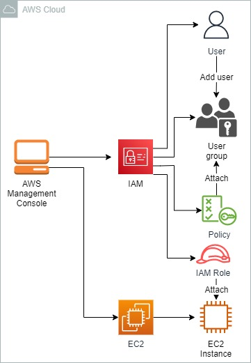
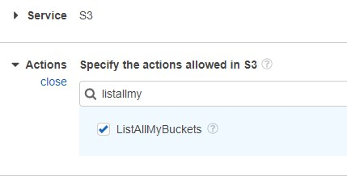
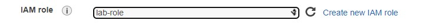
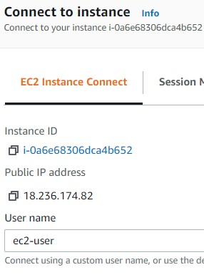
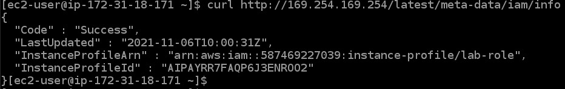

<br />

<p align="center">
  <a href="img/">
    
  </a>
  <h3 align="center">100 days in Cloud</h3>
<p align="center">
    Advanced Roles and Groups Management Using IAM
    <br />
    Lab 55
    <br />
  </p>


</p>

<details open="open">
  <summary><h2 style="display: inline-block">Lab Details</h2></summary>
  <ol>
    <li><a href="#services-covered">Services covered</a>
    <li><a href="#lab-description">Lab description</a></li>
    </li>
    <li><a href="#lab-date">Lab date</a></li>
    <li><a href="#prerequisites">Prerequisites</a></li>    
    <li><a href="#lab-steps">Lab steps</a></li>
    <li><a href="#lab-files">Lab files</a></li>
    <li><a href="#acknowledgements">Acknowledgements</a></li>
  </ol>
</details>

---

## Services Covered
*  **EC2**
*  **IAM**
---

## Lab description

This lab walks through a process of creating new IAM user, user groups, roles and policies. A EC2 Instance would be created with attached Role to it. A IAM user will get limited permissions for testing purposes.

---


### Learning Objectives

* Create IAM groups
* Create IAM users
* Work with IAM policies
* Work with IAM roles and instance profiles

### Lab date
06-11-2021

---

### Prerequisites
* AWS account

---

### Lab steps
1. Navigate to IAM service and **Create group**. Attach the *AmazonEC2ReadOnlyAccess* policy to that group.

2. Create a new user and then add it to the previously created IAM group. 

3. Go to the **Policies** and create a policy. Select S3 for the Service and ListAllMyBuckets for the Action:

   

4. Attach *AmazonS3ReadOnlyAccess* policy to the user created in step 2.

5. Create a new **Role** for EC2 service. Attach *AmazonS3FullAccess* policy to it.

6. Go to **EC2** dashboards and launch Instance. Attach the role from previous step to it.

   

7. Connect with the instance using **EC2 Instance Connect**.

   

8. Use the following command to verify your EC2 instance has the correct instance profile:

   ```
   curl http://169.254.169.254/latest/meta-data/iam/info
   ```

   The command should return a JSON object with an **InstanceProfileArn** value ending in **lab-role**.

   

9. Run the following commands to test that you can create and S3 buckets:

   ```
   aws s3 mb s3://<<bucket-name>>
   ```

---

### Lab files
* 
---

### Acknowledgements
* [cloud academy](https://cloudacademy.com/lab/advanced-roles-and-groups-management-using-iam/?context_resource=lp&context_id=2654)

