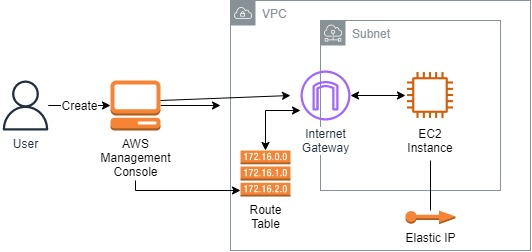
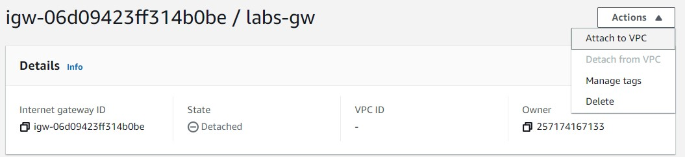
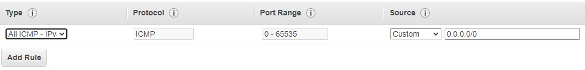
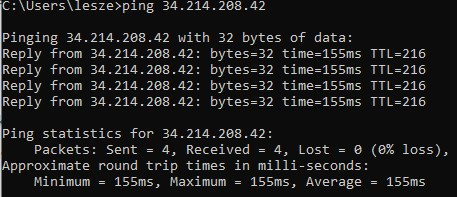
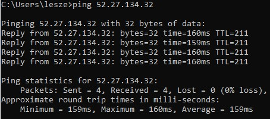

 

  
  <h3 align="center">100 days in Cloud</h3>

    Create a VPC with Route Table, Internet Gateway and resources
     
    Lab 58
     
  

  
<h2 style="display: inline-block">Lab Details</h2>

  <ol>
    <li><a href="#services-covered">Services covered</a>
    <li><a href="#lab-description">Lab description</a></li>
    </li>
    <li><a href="#lab-date">Lab date</a></li>
    <li><a href="#prerequisites">Prerequisites</a></li>    
    <li><a href="#lab-steps">Lab steps</a></li>
    <li><a href="#lab-files">Lab files</a></li>
    <li><a href="#acknowledgements">Acknowledgements</a></li>
  </ol>

---

## Services Covered
*  **EC2**
*  **VPC**
---

## Lab description

In this lab a new VPC will be created with a public subnet. An Internet Gateway and Route Table will be attached in order to allow a EC2 Instance to communicate with internet 

---

### Learning Objectives

* Create VPC
* Create a subnet and an internet gateway
* Configure routing for your VPC using a route table
* Create and manage an EC2 instance and an associated Elastic IP Address (EIP) within your VPC

### Lab date
03-11-2021

---

### Prerequisites
* AWS account

---

### Lab steps
1. In Management Console go to **VPC** and create a new one with following values: CIDR block: 10.0.0.0/16, No IPv6 CIDR block, tenancy: default.

2. Create a new **Subnet**. VPC ID: choose the one created in previous step. Give it a name to indicate that it'll be a public subnet, choose an AZ and provide CIDR block: 10.0.0.0/24. 

3. Create a new **Internet Gateway** for your previously created VPC. Then attach the IGW to the VPC

   

4. Add routes to your previously created VPC **route table**. Choose the route associated with your VPC, and in **Routes** tab click on *Edit routes*. Then *Add route* and set the values to Destination: 0.0.0.0/0 and Target: choose **Internet Gateway** and then select the previously-created one.

5. Create an **EC2 instance** inside your VPC. Navigate to EC2 and launch instance (Amazon Linux 2, t2.micro). Make sure that under **Network** you choose your **VPC **and **enable assigning of Public IPv4 address**. Create a new Security Group that will allow **All CIMP - IPv4** from anywhere inbound traffic. 

   

6. Once your instance is running, copy the **IPv4 Public IP** and try pinging it from you computer:

   

7. Allocate an EIP and associate it with your EC2 instance. Navigate to **VPC** tab and **Allocate Elastic IP address**. Then select it and from *Actions* choose *Associate Elastic IP address*. Provide the following values: Resource type: Instance, Instance: your earlier created instance, Private IP leave blank. 

8. Now if you ping that Elastic IP you should get responses from instance. 

   

---

### Lab files
* 
---

### Acknowledgements
* [cloud academy](https://cloudacademy.com/lab/introduction-virtual-private-cloud-vpc/?context_id=954&context_resource=lp)

