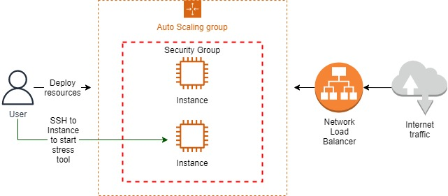
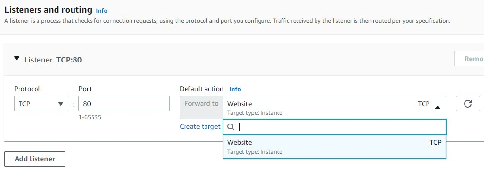
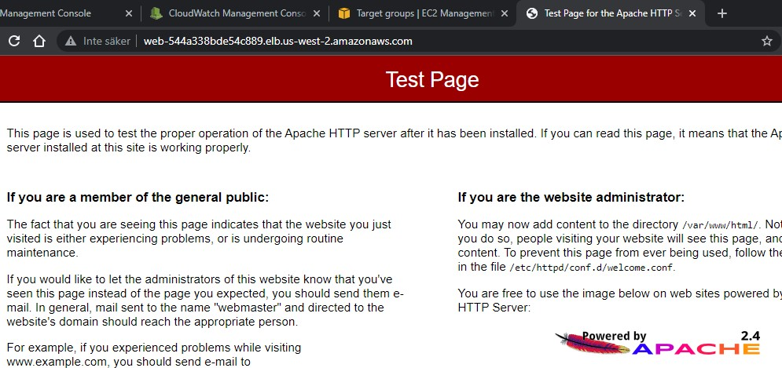
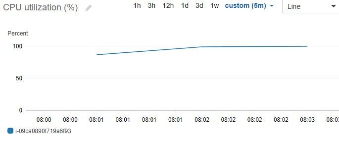
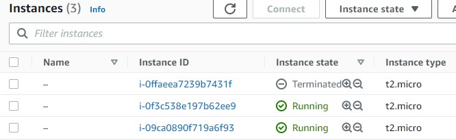

<br />

<p align="center">
  <a href="img/">
    
  </a>
  <h3 align="center">100 days in Cloud</h3>
<p align="center">
    Amazon EC2 Auto Scaling Groups and Network Load Balancer
    <br />
    Lab 59
    <br />
  </p>


</p>

<details open="open">
  <summary><h2 style="display: inline-block">Lab Details</h2></summary>
  <ol>
    <li><a href="#services-covered">Services covered</a>
    <li><a href="#lab-description">Lab description</a></li>
    </li>
    <li><a href="#lab-date">Lab date</a></li>
    <li><a href="#prerequisites">Prerequisites</a></li>    
    <li><a href="#lab-steps">Lab steps</a></li>
    <li><a href="#lab-files">Lab files</a></li>
    <li><a href="#acknowledgements">Acknowledgements</a></li>
  </ol>
</details>

---

## Services Covered
*  **EC2**
---

## Lab description

Configure Auto Scaling to automatically launch EC2 instances using conditions described by CloudWatch alarms. In order to initiate new instances stress tool will cause a CPU utilization spike. 

---


### Learning Objectives

* Create and configure a Network Load Balance
* Utilize Auto Scaling and a Network Load Balancer
* Build an elastic cluster by integrating Auto Scaling with an Elastic Load Balancer


### Lab date
02-11-2021

---

### Prerequisites
* AWS account

---

### Lab steps
1. Create a **Network Load Balancer**. Choose: Internet-facing in all availability zones, **Create target group** in **Listeners and routing**. Target groups configuration: Instances, protocol **TCP**,port **80**, **Health checks Interval** set to 10 seconds. Back in NLB creation tab choose the newly created target group

   
   
2. When the load balancer is created select it and from **Actions** drop-down menu choose **Edit attributes**. Then enable **Cross-Zone Load Balancing.**

3. Go to **Target Groups**, choose the earlier created group and change it's **Deregistration delay** to 30 seconds under **Attributes** tab.

4. Create a **Security group**. Allow inbound **SSH** and **HTTP** from anywhere.

5. Create a **Launch Template**: Amazon Linux 2, t2.micro, add key pair and attach secuirty group from previous step. Enable **Detailed CloudWatch monitoring**. Add following **User data**

   ```
   #!/bin/bash
   
   # Enable the epel-release
   sudo amazon-linux-extras install epel
   
   # Install and start Apache web server
   sudo yum install -y httpd php
   
   # Start the httpd service
   service httpd start
   
   # Install CPU stress test tool
   sudo yum install -y stress
   
   ```

   This bash script installs PHP, an Apache webserver (httpd), and a tool for stress testing called Stress.

6. Create an **Auto Scaling Group** and use launch template from previous step. Under **Load balancing** choose *Attach to an existing load balancer* and use the one created earlier. Under **Health check grace period**, enter *80*. Set **Maximum capacity** to 4. Scaling policies: choose Target tracking scaling policy. In the **Instances need** text-box, enter *80*.

7. Navigate to Load Balancer and open the DNS name in your browser. You should see Apache webserver sample page

   

8. Terminate that running instance, the auto scaling group will detect the changes and initiate a new Instance. SSH to that instance and run following command to run stress

   ```
   stress --cpu 2 --io 1 --vm 1 --vm-bytes 128M --timeout 5m
   ```

   This will cause a CPU utilization spike which will trigger the Auto Scaling Group to initiate additional instance. You can follow the CPU utilization in CloudWatch detailed monitoring.

   

   

9. You will see two running instances, or if your auto-scaling group has already initiated a scale-in (because the stress command finished and CPU utilization dropped), you will see two terminated instances including the one you manually terminated, and one running instance.

---

### Lab files
* 
---

### Acknowledgements
* [cloud academy](https://cloudacademy.com/lab/working-amazon-ec2-auto-scaling-groups/?context_id=954&context_resource=lp)

