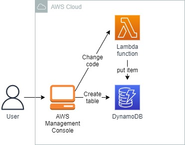

<br />

<p align="center">
  <a href="img/">
    
  </a>
  <h3 align="center">100 days in Cloud</h3>
<p align="center">
    Creating DynamoDB table and python Lambda function
    <br />
    Lab 61
    <br />
  </p>


</p>

<details open="open">
  <summary><h2 style="display: inline-block">Lab Details</h2></summary>
  <ol>
    <li><a href="#services-covered">Services covered</a>
    <li><a href="#lab-description">Lab description</a></li>
    </li>
    <li><a href="#lab-date">Lab date</a></li>
    <li><a href="#prerequisites">Prerequisites</a></li>    
    <li><a href="#lab-steps">Lab steps</a></li>
    <li><a href="#lab-files">Lab files</a></li>
    <li><a href="#acknowledgements">Acknowledgements</a></li>
  </ol>
</details>

---

## Services Covered
*  **DynamoDB**
*  **AWS Lambda**

---

## Lab description

*The company you work for are developing a system that collects data events from client applications on different devices and platforms periodically. The data event is processed by an AWS Lambda function which stores the event data in an Amazon DynamoDB table. The DynamoDB items will be later processed asynchronously by a different part of the system*.

*You have been tasked with implementing the required change to the AWS Lambda function in a development AWS account so that the change can be tested and verified by another team before being accepted.*

*In this challenge lab, an AWS Lambda function named **dynamodb-lambda** with the default new function implementation exists.*

---


### Learning Objectives

* Creating a DynamoDB table
* Updating the AWS Lambda function using the given implementation
* Testing the function's implementation using the AWS Lambda Console
* Modifying the implementation of the AWS Lambda function

---


### Lab date
31-10-2021

---

### Prerequisites
* AWS account

---

### Lab steps
1. **Create a DynamoDB Table**. Call it **items**, partition key **id** of type **String** and sort key **type** of type **String**.

2. Upload the Lambda function code:

   ```python
   import json
   import boto3
   import uuid
   def lambda_handler(event, context):
       print(event)
       TABLE_NAME = '<REPLACE-ME>'
       item_id = event['id'] or str(uuid.uuid4())
       item = {
           'id': {
               'S': item_id
           },
           'type': {
               'S': event['type'].lower()
           },
           'forward': {
               'BOOL': False
           }
       }
       if item['type']['S'] == 'mobile':
           item['forward']['BOOL'] = True
       dynamodb = boto3.client('dynamodb')
       response = dynamodb.put_item(TableName=TABLE_NAME, Item=item)
       status = response['ResponseMetadata']['HTTPStatusCode']
       return {'statusCode': status, 'body': json.dumps(item)}
   ```

3. **Invoke the Lambda Function with a Test Payload**. Using the **Test** functionality of the AWS Lambda Console, test your Lambda implementation with the following JSON payload:

   ```json
   { 
       "id": "1", 
       "type": "mobile" 
   }
   ```

4. **Modify the Lambda Implementation**. Modify the Lambda function implementation so that events where the **type** is **desktop** have the **forward** attribute set to **true**.

   ```python
   elif item['type']['S'] == 'desktop':
           item['forward']['BOOL'] = True
   ```

   

---

### Lab files
* 
---

### Acknowledgements
* [cloud academy](https://cloudacademy.com/lab-challenge/amazon-dynamo-db-and-aws-lambda-challenge/)

