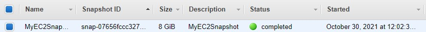
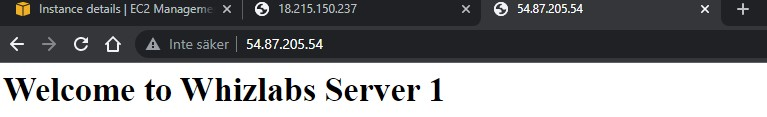

<br />

<p align="center">
  <a href="img/">
    
  </a>
  <h3 align="center">100 days in Cloud</h3>
<p align="center">
    Creating New EC2 Instance using Snapshot
    <br />
    Lab 62
    <br />
  </p>


</p>

<details open="open">
  <summary><h2 style="display: inline-block">Lab Details</h2></summary>
  <ol>
    <li><a href="#services-covered">Services covered</a>
    <li><a href="#lab-description">Lab description</a></li>
    </li>
    <li><a href="#lab-date">Lab date</a></li>
    <li><a href="#prerequisites">Prerequisites</a></li>    
    <li><a href="#lab-steps">Lab steps</a></li>
    <li><a href="#lab-files">Lab files</a></li>
    <li><a href="#acknowledgements">Acknowledgements</a></li>
  </ol>
</details>

---

## Services Covered
*  **EC2**
*  **EBS**

---

## Lab description

This lab walks you through creation of an snapshot of EC2 instance and how to launch a new EC2 instance using the AMI of that snapshot.

---


### Learning Objectives

* Create 2 EC2 Instances
* Create a Snapshot
* Create an AMI Image and launch an instance out of it

---


### Lab date
30-10-2021

---

### Prerequisites
* AWS account

---

### Lab steps
1. Launch **EC2 Instance**. Use the following **User data**:

   ```
   #!/bin/bash
   
   sudo su
   
   yum update -y
   
   yum install httpd -y
   
   echo "<html><h1> Welcome to Whizlabs Server 1 </h1><html>" >> /var/www/html/index.html
   
   systemctl start httpd
   
   systemctl enable httpd
   ```

   Attach a Security Group allowing inbound traffic for SSH and HTTP from anywhere.

2. Test the Apache server by navigating to the instances Public IP.

   

3.  Create a Snapshot of EC2 Instance. Under **Elastic block Store** navigate to **Snapshots** and create volume snapshot of your instance volume.

4. Create AMI with Snapshot. Select the created snapshot, clock on Actions and select **Create Image**. 

   

5. Next create an EC2 Instance using newly create AMI. Navigate to **AMIs** and launch new instance of type t2.micro and add **User data**

   ```
   #!/bin/bash -ex 
   
   sudo service httpd restart
   ```

   Attach the previously created security group.

6. When the new instances status is running navigate to its **Public IP** and you should get the same response as from server 1:

   

---

### Lab files
* 
---

### Acknowledgements
* [whizlabs](https://play.whizlabs.com/site/task_details?lab_type=1&task_id=15&quest_id=35)

