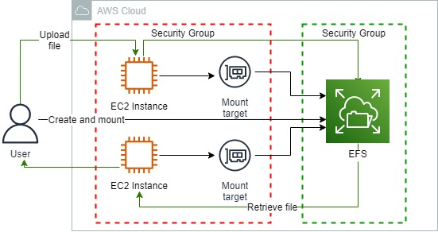
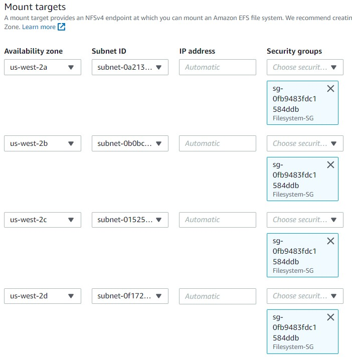
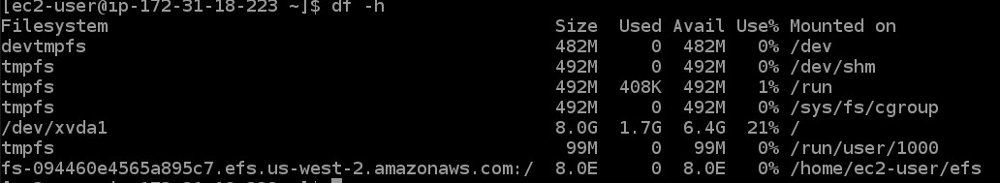
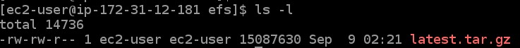

<br />

<p align="center">
  <a href="img/">
    
  </a>
  <h3 align="center">100 days in Cloud</h3>
<p align="center">
    Mount file system to EC2 instances
    <br />
    Lab 63
    <br />
  </p>


</p>

<details open="open">
  <summary><h2 style="display: inline-block">Lab Details</h2></summary>
  <ol>
    <li><a href="#services-covered">Services covered</a>
    <li><a href="#lab-description">Lab description</a></li>
    </li>
    <li><a href="#lab-date">Lab date</a></li>
    <li><a href="#prerequisites">Prerequisites</a></li>    
    <li><a href="#lab-steps">Lab steps</a></li>
    <li><a href="#lab-files">Lab files</a></li>
    <li><a href="#acknowledgements">Acknowledgements</a></li>
  </ol>
</details>

---

## Services Covered
*  **EC2**
*  **EFS**

---

## Lab description

In this lab I will create an Elastic File System that will span across an entire region, mount it to an instance, copy several files, and then mount it to a different instance and retrieve files from it. 

### Learning Objectives

* Create file system
* Install NFS client on the EC2
* Mount the NFS file system
* Update the ownership of the efs directory and download a test file to it

---


### Lab date
29-10-2021

---

### Prerequisites
* AWS account
* An EC2 Instance running

---

### Lab steps
1. In EC2 create a **Security Group** for the that will allow access to EFS. It should allow inbound access of type **NFS** from Instances Security group on port 2049. 

2. Create file system in **EFS**. Keep the default VPC and Regional type, on the **Network access** tab replace the *deafult* SG's with the one created in previous step.

   

   No need to change anything else. Continue to**Create**.

3. Go back to **EC2** and connect to an Instance using **EC2 Instance Connect**. Leave the window open.

4. Go back to EFS tab and choose your EFS, then click on **Attach**. Use the command for **Mount via DNS**:

   ```
   sudo mount -t nfs4 -o nfsvers=4.1,rsize=1048576,wsize=1048576,hard,timeo=600,retrans=2,noresvport fs-094460e4565a895c7.efs.us-west-2.amazonaws.com:/ efs
   ```

   Save it because for later.

5. Back in the Instance Connect tab install the **NFS Client**.

   ```
   sudo yum install -y nfs-utils
   ```

   Then create a directory to mount the file system:

   ```
   mkdir efs 
   ```

   Next paste the *sudo mount* command from previous step and run it. To verify the mount was successful, enter:

   ```
   df -h
   ```

   

   Update the ownership of the efs folder to the ec2-user using the following command:

   ```
   sudo chown ec2-user efs/
   ```

6. Upload a file to the file system. Navigate to the efs folder:

   ```
   cd efs
   ```

   Then download for example wordpress distribution

   ```
   wget https://wordpress.org/latest.tar.gz
   ```

   

7. Connect to the second instance. Install NFS Client, create efs directory, run the *sudo mount* command, change ownership of the efs folder. Navigate to efs folder and run:

   ```
   ls -l
   ```

   

   It should display the package downloaded in the first Instance.

   
---

### Lab files
* 
---

### Acknowledgements
* [cloud academy](https://cloudacademy.com/lab-challenge/amazon-s3-and-aws-lambda-challenge/)

