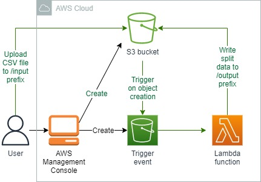

<br />

<p align="center">
  <a href="img/">
    
  </a>
  <h3 align="center">100 days in Cloud</h3>
<p align="center">
    Amazon S3 triggering AWS Lambda on events
    <br />
    Lab 65
    <br />
  </p>

</p>

<details open="open">
  <summary><h2 style="display: inline-block">Lab Details</h2></summary>
  <ol>
    <li><a href="#services-covered">Services covered</a>
    <li><a href="#lab-description">Lab description</a></li>
    </li>
    <li><a href="#lab-date">Lab date</a></li>
    <li><a href="#prerequisites">Prerequisites</a></li>    
    <li><a href="#lab-steps">Lab steps</a></li>
    <li><a href="#lab-files">Lab files</a></li>
    <li><a href="#acknowledgements">Acknowledgements</a></li>
  </ol>
</details>

---

## Services Covered
*  **S3**
*  **AWS Lambda**

---

## Lab description

*A company has a legacy system that accepts CSV (comma separated values) file uploads. The company is preparing to migrate the system to the cloud.*

*The new cloud-based system will use an event-based trigger on an Amazon S3 bucket to run an AWS Lambda function and perform file processing. When a CSV file is uploaded, each line of the file is examined. The line is copied to a new file placed under a folder named after the first field in the line.*

### Learning Objectives

* Creating an Amazon S3 bucket
* Implementing a Python AWS Lambda function using a pre-existing implementation
* Modifying the function code to generate random identifiers that are 12 characters long
* Testing the cloud-based system by uploading a test CSV file to ensure that the AWS Lambda function is triggered

---


### Lab date
27-10-2021

---

### Prerequisites
* AWS account

---

### Lab steps
1. **Create an Amazon S3 Bucket**, then create a folder in the S3 bucket named **input**.

2. Create an AWS Lambda trigger that satisfies the following: triggered by S3 events, on **all object create events**, only triggered by objects created in the **input/** prefix and only with **.csv** suffix.

3.  Implement the Lambda function:

   ```
   import io
   import boto3
   import string
   import random
   
   s3 = boto3.client("s3")
   INPUT_PREFIX = "input"
   OUTPUT_PREFIX = "output"
   ID_LENGTH = 12
   
   
   def random_id():
       return "".join(random.choices(string.ascii_uppercase + string.digits, k=ID_LENGTH))
   
   
   def separate_object(bucket, key):
       body = s3.get_object(Bucket=bucket, Key=key)["Body"].read().decode("utf-8")
       output = {}
       for line in io.StringIO(body):
           fields = line.split(",")
           output.setdefault(fields[0], []).append(line)
       return output
   
   
   def write_objects(objects, bucket, key):
       file_name = key.split("/")[-1]
       for prefix in objects.keys():
           identifier = random_id()
           s3.put_object(
               Body=",".join(objects[prefix]),
               Key=f"{OUTPUT_PREFIX}/{prefix}/{identifier}-{file_name}",
               Bucket=bucket,
           )
   
   
   def lambda_handler(event, context):
       record = event["Records"][0]["s3"]
       bucket = record["bucket"]["name"]
       key = record["object"]["key"]
   
       if key.startswith(INPUT_PREFIX):
           objects = separate_object(bucket, key)
           write_objects(objects, bucket, key)
   
       return "OK"
   ```

   The **OUTPUT_PREFIX** is set to **output** and **ID_LENGTH** is 12 characters long as instructed.

4. Upload a example CSV [file](test.csv) to the input folder in your S3 bucket.

5. Check if the files has been separated and created under the **output** folder.


### Lab files
* [test.csv](test.csv)
---

### Acknowledgements
* [cloud academy](https://cloudacademy.com/lab-challenge/amazon-s3-and-aws-lambda-challenge/)

