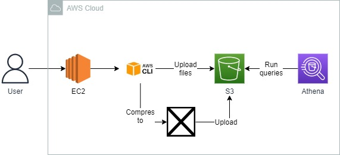
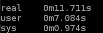
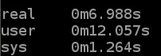
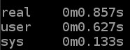

<br />

<p align="center">
  <a href="img/">
    
  </a>
  <h3 align="center">100 days in Cloud</h3>
<p align="center">
    Efficiently Storing Data in S3 for Data Analytics Solutions
    <br />
    Lab 66
    <br />
  </p>

</p>

<details open="open">
  <summary><h2 style="display: inline-block">Lab Details</h2></summary>
  <ol>
    <li><a href="#services-covered">Services covered</a>
    <li><a href="#lab-description">Lab description</a></li>
    </li>
    <li><a href="#lab-date">Lab date</a></li>
    <li><a href="#prerequisites">Prerequisites</a></li>    
    <li><a href="#lab-steps">Lab steps</a></li>
    <li><a href="#lab-files">Lab files</a></li>
    <li><a href="#acknowledgements">Acknowledgements</a></li>
  </ol>
</details>

---

## Services Covered
*  **EC2**
*  **S3**
*  **AWS CLI**
*  **Athena**

---

## Lab description

This short lab is mostly about measuring and benchmarking various transfer options. Depending on solution a Cloud Architect most know which option is best for specific case. Here I will test **sequentially**, **parallel** and **sync** types and measure how long it takes to upload those files to a S3 bucket. Data will be converted so that it'll be used in Athena and compressed to a parquet format.

### Learning Objectives

* Use the AWS command-line tool to copy data from an EC2 instance to S3
* Partition data files in S3
* Compress data to reduce costs
* Convert data into different formats to reduce costs and maximize performance

---


### Lab date
26-10-2021

---

### Prerequisites
* AWS account

---

### Lab steps
1. In EC2 start a new Instance. When **running** connect to your instance using **EC2 Instance Connect**  a new SSH command-line will open with AWS CLI tool on it.

2. Create an S3 bucket

   ```
   bucket_name="ca-labs-xxxx"
   aws s3 mb "s3://$bucket_name"
   ```

3. Create a new folder and make some random files in it:

   ```
   mkdir files
   cd files
   seq -w 1 20 | xargs -I % dd if=/dev/urandom of=file% bs=512k count=1
   ```

   The seq command generates a sequence of numbers and dd writes data to files.

4. To copy those files to S3 bucket sequentially:

   ```
   time ( for f in $(find . -type f); do aws s3 cp $f "s3://$bucket_name/sequential/"; done )
   ```

   This command will even measure the time it took to cpy those files:

   

5. Copy files sequentially:

   ```
   time ( find . -type f -print0 | xargs -0 -n1 -P4 -I {} aws s3 cp {} "s3://$bucket_name/parallel/" )
   ```

   

   This results with marginally shorter time to copy them.

6. But the greatest time improvement occurs while using sync option:

   ```
   time ( aws s3 sync . "s3://$bucket_name/sync/" )
   ```

   

7. Next create a another folder

   ```
   mkdir ~/colors
   cd ~/colors
   ```

   and create a *huge* chunk of sample data:

   ```
   for color in blue green red; do
     echo "\"count\",\"timestamp\",\"data_field\",\"color\"" > "$color.csv"
     for i in $(seq 1 40); do
       echo "$i,$(date +%s%N),$(openssl rand -hex 8),$color" >> "$color.csv"
     done
   done
   ```

   Then copy that data in to S3

   ```
   aws s3 sync . "s3://$bucket_name/colors"
   ```

8. Partitioning Data in S3 for Use with Athena. Go to Athena and switch the active workgroup to S3 bucket. To query the data run:

   ```
   CREATE EXTERNAL TABLE `lab_db`.`colors`(
     `count` string, 
     `timestamp` string, 
     `data_field` string,
     `color` string)
   ROW FORMAT DELIMITED 
     FIELDS TERMINATED BY ', ' 
     LINES TERMINATED BY '\n' 
   LOCATION
     's3://ca-labs-xxxx/colors'
   TBLPROPERTIES (
     'skip.header.line.count'='1')
   ```

   Then run a new query:

   ```
   SELECT * FROM lab_db.colors;
   ```

9. To partition your color files in S3, in the Linux shell, enter the following commands:

   ```
   aws s3 mv "s3://$bucket_name/colors/red.csv" "s3://$bucket_name/colors/color=red/red.csv"
   aws s3 mv "s3://$bucket_name/colors/blue.csv" "s3://$bucket_name/colors/color=blue/blue.csv"
   aws s3 mv "s3://$bucket_name/colors/green.csv" "s3://$bucket_name/colors/color=green/green.csv"
   ```

   

10. In the query editor window, replace the existing contents with the following SQL statement, replacing **ca-labs-xxxx** with the name of your S3 bucket:

    ```
    CREATE EXTERNAL TABLE `lab_db`.`colors`(
      `count` string, 
      `timestamp` string, 
      `data_field` string)
    PARTITIONED BY ( 
      `color` string)
    ROW FORMAT DELIMITED 
      FIELDS TERMINATED BY ', ' 
      LINES TERMINATED BY '\n' 
    LOCATION
      's3://ca-labs-xxxx/colors'
    TBLPROPERTIES (
      'skip.header.line.count'='1')
    ```

    and then

    ```
    MSCK REPAIR TABLE lab_db.colors;
    ```

11. Converting Data Files in S3 for Use With Athena.  In the Linux command-line shell, enter the following commands to create and move to a new directory:

    ```
    mkdir ~/convert
    cd ~/convert
    ```

    To generate a CSV file enter the following command

    ```
    filename=data.csv
    echo "\"count\",\"timestamp\",\"data_field_one\",\"data_field_two\"" > $filename
    for i in $(seq 1 200); do
      echo "$i,$(date +%s%N),$(openssl rand -hex 8),aaaabbbbcccc" >> $filename
    done
    
    ```

    and copy it to s3

    ```
    aws s3 cp data.csv "s3://$bucket_name/convert/text/data.csv"
    ```

12. To convert your CSV to Parquet, enter the following command:

    ```
    csv2parquet data.csv
    ```

    and copy it to s3:

    ```
    aws s3 cp data.parquet "s3://$bucket_name/convert/parquet/data.parquet"
    ```

13. Return to your browser tab with Athena open. In the query editor window, replace the existing contents with the following SQL statement, replacing **ca-labs-xxxx** with the name your S3 bucket:

    ```
    
    ```

14. Compressing Data Files in S3 for Use With Athena. In the Linux shell, to create a new directory and move to it, enter the following commands:

    ```
    mkdir ~/json
    cd ~/json
    
    mkdir raw
    mkdir compressed
    ```

15. To generate some JSON data, enter the following command:

    ```
    filename=data.json
    for i in $(seq 1 200); do
      ts=$(date +%s%N)
      field1=$(openssl rand -hex 8)
      field2="aaaabbbbcccc"
      echo "{ \"count\": $i, \"ts\": $ts, \"field_one\": \"$field1\", \"field_two\": \"$field2\"}" >> raw/$filename
    done
    cat raw/$filename | gzip > compressed/$filename.gz
    ```

16. To copy the data to your S3 bucket, enter the following command replacing **ca-labs-xxxx** with the name of your bucket:

    ```
    aws s3 sync . "s3://$bucket_name/json/"
    ```

17. Return to your browser tab with Athena open. In the query editor window, replace the existing contents with the following SQL statement, replacing **ca-labs-xxxx** with the name your S3 bucket:

    ```
    CREATE EXTERNAL TABLE `lab_db`.`json_raw`(
      `count` int, 
      `ts` bigint,
      `field_one` string,
      `field_two` string)
    ROW FORMAT SERDE 'org.openx.data.jsonserde.JsonSerDe'
    WITH SERDEPROPERTIES (
      'serialization.format' = '1'
    )
    LOCATION
      's3://ca-labs-xxxx/json/raw'
    ```

18. To view all records in your raw JSON table, in the query editor window, enter the following SQL statement:

    ```
    SELECT * FROM lab_db.json_raw;
    ```


### Lab files
* 
---

### Acknowledgements
* [cloudacademy](https://cloudacademy.com/lab/efficiently-storing-data-s3-data-analytics-solutions/)

