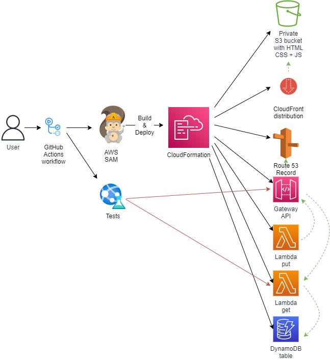

<br />

<p align="center">
  <a href="img/">
    
  </a>
  <h3 align="center">100 days in Cloud</h3>
<p align="center">
    SAM-IaC-CloudFront-Website-for-Cloud-Resume-Challenge
    <br />
    Lab 67
    <br />
  </p>


</p>

<details open="open">
  <summary><h2 style="display: inline-block">Lab Details</h2></summary>
  <ol>
    <li><a href="#services-covered">Services covered</a>
    <li><a href="#lab-description">Lab description</a></li>
    </li>
    <li><a href="#lab-date">Lab date</a></li>
    <li><a href="#prerequisites">Prerequisites</a></li>    
    <li><a href="#lab-steps">Lab steps</a></li>
    <li><a href="#lab-files">Lab files</a></li>
    <li><a href="#acknowledgements">Acknowledgements</a></li>
  </ol>
</details>

---

## Services Covered
*  **AWS SAM**

---

## Lab description
Second part of my Cloud Resume Challenge SAM deployment. I've already [deployed](https://cloudofthings.net/lab-70/) the website, API and Lambda. I will finish up the template by creating a DynamoDB table, two Lambda functions, one for updating the visitors count and second for getting the latest value. The deployment will be moved to more of a CI/CD kind of manner that is GitHub actions, so whenever I commit new code the workflow will initiate AWS SAM Build & Deploy as well as two test run within the workflow.

### Lab date
25-10-2021

---

### Prerequisites
* AWS account,
* SAM CLI installed
* Recommended: [aws-vault](https://github.com/99designs/aws-vault)
* Docker installed, for local Lambda functions testing purposes

---

### Lab steps
1. In the SAM template I create a new DynamoDB resource:

   ```yaml
   DynamoDBTable:
       Type: AWS::DynamoDB::Table
       Properties:
         TableName: cloud-resume-challenge
         BillingMode: PAY_PER_REQUEST
         AttributeDefinitions:
           - AttributeName: "ID"
             AttributeType: "S"
         KeySchema:
           - AttributeName: "ID"
             KeyType: "HASH"
   ```

2. Then I created two Lambda functions:

   ```yaml
   GetCountFunction:
       Type: AWS::Serverless::Function
       Properties:
         CodeUri: get-function/
         Handler: app.lambda_handler
         Runtime: python3.9
         Architectures:
           - x86_64
         Events:
           HelloWorld:
             Type: Api 
             Properties:
               Path: /get
               Method: get
   
     PutCountFunction:
       Type: AWS::Serverless::Function 
       Properties:
         Policies:
           - DynamoDBCrudPolicy:
               TableName: cloud-resume-challenge
         CodeUri: put-function/
         Handler: app.lambda_handler
         Runtime: python3.9
         Architectures:
           - x86_64
         Events:
           HelloWorld:
             Type: Api
             Properties:
               Path: /put
               Method: get
   ```

3. For testing purposes I run the code locally using the **sam local invoke** command that created a Docker Image

   ```bash
   sam build && aws-vault exec sam-user --no-session -- sam local invoke PutCountFunction
   ```

4. The index.html need a JavaScript that would fetch the latest count from the DynamoDB table.

   ```javascript
   <script type = "text/javascript">
                 var apiUrl = "https://.eu-north-1.amazonaws.com/Prod/put";
                   fetch(apiUrl)
                   .then(() => fetch("https://<<YOUR_API>>.eu-north-1.amazonaws.com/Prod/get"))
                   .then(response => response.json())
                   .then(data =>{
                       document.getElementById('body').innerHTML = data
                 console.log(data)});
               </script>
   ```

5. I've set up the CI/CD pipeline on GitHub Actions. The pipeline activates on me pushing the code starting with SAM validation, Build and Deploy. I included two test so called **integration test** which is just a simple curl command chain and a **end to end JavaScript** test :

   ```yaml
   name: SAM Validate, Test, Build, Deploy
   on:
     push:
       branches: [ main ]
   
   jobs:  
     build-and-deploy-infra:
       runs-on: ubuntu-latest
       steps:
         - uses: actions/checkout@v2
         - uses: actions/setup-python@v2
           with:
             python-version: '3.9'
         - uses: aws-actions/setup-sam@v1
         - uses: aws-actions/configure-aws-credentials@v1
           with:
             aws-access-key-id: ${{ secrets.ACCESS_KEY }}
             aws-secret-access-key: ${{ secrets.SECRET_ACCESS_KEY }}
             aws-region: eu-north-1
         - name: SAM Validate
           run: |
             sam validate
         - name: SAM Build
           run: |
             sam build
         - name: SAM Deploy
           run: |
             sam deploy --no-confirm-changeset --no-fail-on-empty-changeset
     
     integration-test-backend:
       needs: build-and-deploy-infra
       runs-on: ubuntu-latest
       steps:
         - uses: actions/checkout@v2
         - run: make integration-test
   
     end-to-end-test:
       needs: integration-test-backend
       runs-on: ubuntu-latest
       steps:
         - uses: actions/checkout@v2
         - uses: actions/setup-node@v2
           with:
             node-version: 14
         - run: cd tests/end-to-end-test && npm install && node index.js
   ```

---
### Lab files
* [SAM template](template.yaml)
---

### Acknowledgements
* [Cloud Resume Challenge](https://cloudresumechallenge.dev/)

