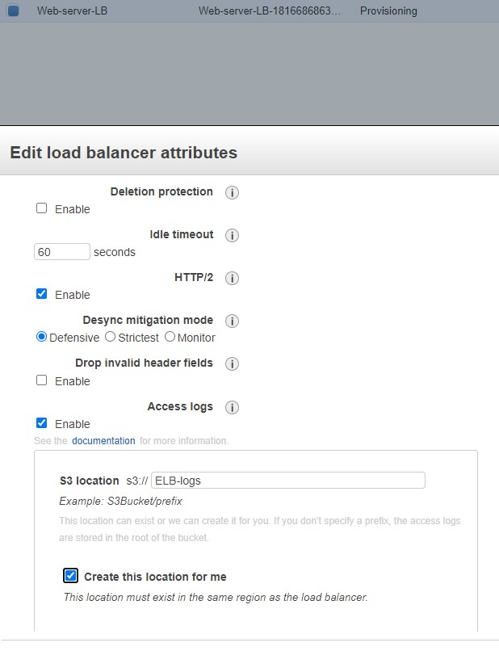
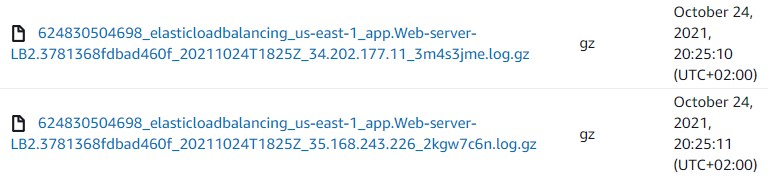

<br />

<p align="center">
  <a href="img/">
    
  </a>
  <h3 align="center">100 days in Cloud</h3>
<p align="center">
    Storing ELB Access Logs in S3 bucket
    <br />
    Lab 68
    <br />
  </p>


</p>

<details open="open">
  <summary><h2 style="display: inline-block">Lab Details</h2></summary>
  <ol>
    <li><a href="#services-covered">Services covered</a>
    <li><a href="#lab-description">Lab description</a></li>
    </li>
    <li><a href="#lab-date">Lab date</a></li>
    <li><a href="#prerequisites">Prerequisites</a></li>    
    <li><a href="#lab-steps">Lab steps</a></li>
    <li><a href="#lab-files">Lab files</a></li>
    <li><a href="#acknowledgements">Acknowledgements</a></li>
  </ol>
</details>

---

## Services Covered
*  **Amazon EC2**

---

## Lab description
This lab walks you through the steps of creating Application Load Balancer for two Instances with Apache server on them. The ELB will create Access logs into a S3 bucket.

### Lab date
24-10-2021

---

### Prerequisites
* AWS account

---

### Lab steps
1. Launch an Ec2 Instance of type Amazon Linux 2 t2.micro. Set up the user data to display a simple response:

   ```
   #!/bin/bash
   sudo su
   yum update -y
   yum install -y httpd
   systemctl start httpd
   systemctl enable httpd
   echo "Response coming from server A" > /var/www/html/index.html
   ```

   For Security Group options allow inbound traffic for HTTP. 

2. Launch similar Instance with slightly changed response

   ```
   #!/bin/bash
   sudo su
   yum update -y
   yum install -y httpd
   systemctl start httpd
   systemctl enable httpd
   echo "Response coming from server B" > /var/www/html/index.html
   ```

   Use the same Security Group as for the first one.

3. Create a Application Load Balancer with Internet-facing scheme and of IPv4 type. Choose the same Security Group as for instances. Create a ne Target Group of type Instances and provide it in **Listeners and routing** for HTTP. 

4. Configure the Load Balancer to store Access logs in S3 bucket. Choose the ELB and from Actions drop-down menu choose Edit attributes

   

5. Test log storing by browsing to the ELS DNS

   

6. The logs are successfully saved in the bucket

   

   ---

   ### Lab files

* []()
---

### Acknowledgements
* [Whizlabs](https://play.whizlabs.com/site/task_details?lab_type=1&task_id=56&quest_id=36)

