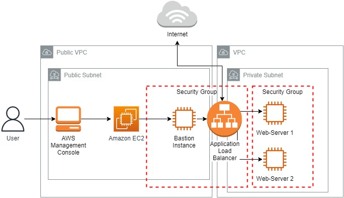
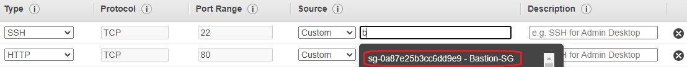
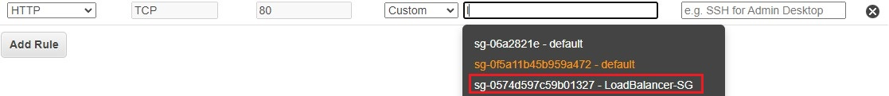
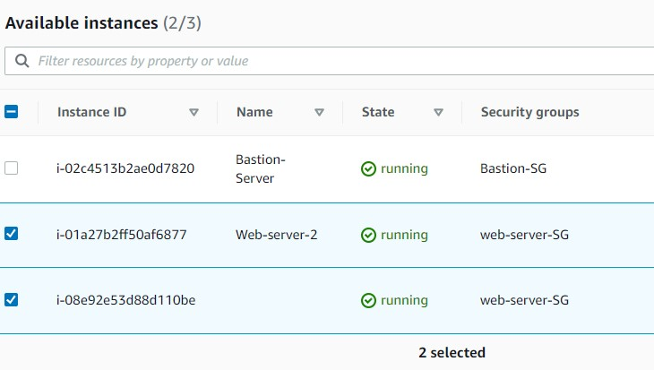
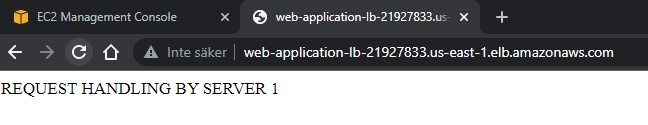
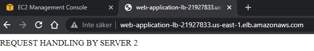

<br />

<p align="center">
  <a href="img/">
    
  </a>
  <h3 align="center">100 days in Cloud</h3>
<p align="center">
    Highly Available Web Application and Bastion Host on EC2
    <br />
    Lab 69
    <br />
  </p>


</p>

<details open="open">
  <summary><h2 style="display: inline-block">Lab Details</h2></summary>
  <ol>
    <li><a href="#services-covered">Services covered</a>
    <li><a href="#lab-description">Lab description</a></li>
    </li>
    <li><a href="#lab-date">Lab date</a></li>
    <li><a href="#prerequisites">Prerequisites</a></li>    
    <li><a href="#lab-steps">Lab steps</a></li>
    <li><a href="#lab-files">Lab files</a></li>
    <li><a href="#acknowledgements">Acknowledgements</a></li>
  </ol>
</details>

---

## Services Covered
*  **Amazon EC2**

---

## Lab description
This lab walks you through the steps to deploy a highly available Web application and use Bastion host to control the access to underlying private instances.

### Lab date
23-10-2021

---

### Prerequisites
* AWS account

---

### Lab steps
1. Create a Bastion Server. In EC2 choose Amazon Linux 2, t2.micro. Choose **Auto-assign Public IP**, then create a new security group that allows only SSH.

2. Create a Security Group for Load Balancer. Use the same VPC as the Instances. Add Inbound rule that allows HTTP traffic from anywhere.

3. Now launch the **web server that will reside in private subnet**. I already have an additional private VPC with a NAT gateway, the private subnet is attached to a rout table to rout traffic via NAT gateway to the internet. This EC2 instance will run and httpd server created with **user data**:

   ```bash
   #!/bin/bash
   sudo su
   yum update -y
   yum install httpd -y
   systemctl start httpd
   systemctl enable httpd
   echo "REQUEST HANDLING BY SERVER 1" > /var/www/html/index.html
   ```

   Create a new Security Group for the instance, it should accept SSH only from Bastions SG 

   

   And allow HTTP traffic only form Load Balancers SG

   

4. Repeat the steps and create additional Web-server.

5. Create a Target Group. It should use HTTP, and the same VPC as Bastion. And type /index.html for health checks path on HTTP. Register the two **web-server** instances as targets.

   

6. Create an Application load balancer. Internet facing on IPv4 in Bastions VPC. For mappings choose the public subnets and LoadBalancers Security Group. Listener is the web-app Target Group from previous step. 

7. Connect to web server via Bastion. Using SSH connect to Bastion, then create a key on in using the one created for **Web-servers**. Using this key SSH to a web-server:

   ```
   ssh -i web-serverkey.pem  ec2-user@<Web-server-1 private IP>
   ```

   

8. Navigate to Load Balancers and copy it's DNS name into a browser:

   

   

   The requests are properly handled by two **web-servers** from private subnet.

---
### Lab files
* []()
---

### Acknowledgements
* [Whizlabs](https://play.whizlabs.com/site/task_details?lab_type=1&task_id=42&quest_id=35)

