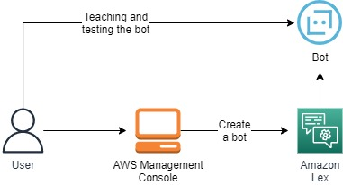
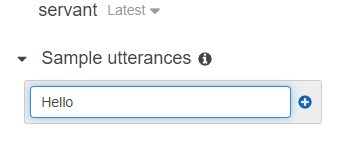
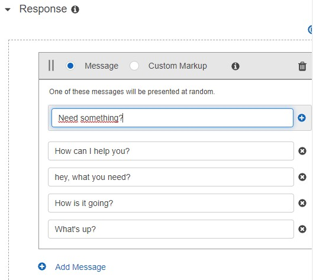
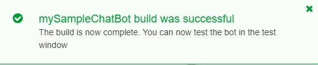
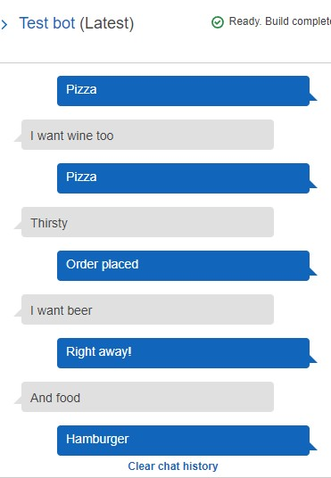

 

  
  <h3 align="center">100 days in Cloud</h3>

    Create a sample chatbot using Amazon Lex
     
    Lab 71
     
  

  
<h2 style="display: inline-block">Lab Details</h2>

  <ol>
    <li><a href="#services-covered">Services covered</a>
    <li><a href="#lab-description">Lab description</a></li>
    </li>
    <li><a href="#lab-date">Lab date</a></li>
    <li><a href="#prerequisites">Prerequisites</a></li>    
    <li><a href="#lab-steps">Lab steps</a></li>
    <li><a href="#lab-files">Lab files</a></li>
    <li><a href="#acknowledgements">Acknowledgements</a></li>
  </ol>

---

## Services Covered
*  **Amazon Lex**

---

## Lab description
Deploy a sample chatbot using Amazon Lex seems like something that might be useful in the future, so I figured I'll give it a try in this lab. This lab is mostly about "teaching" the bot how to respond to utterances. It's a tiresome and frustrating process, but I just wanted to get a feeling of how it works. It's powered by some Machine Learning.

### Lab date
21-10-2021

---

### Prerequisites
* AWS account

---

### Lab steps
1. In the Amazon Lex section click on **Create**, give your chat a name and choose language.

2. When the chatbot tab opens click on **Create intent**.Provide some **utterances**, expressions for the bot.

   

3. Then add some **Responses**.

   

   And **Save intent**.

4. Create one more Intent. Basically make a probable question from users and responses from Intent. Save that one too.

5. **Build the bot**.

   

6. Now you can test your bot.

   

   There's some place for improvement, but I'll continue on teaching the bot.

---
### Lab files
* 

---

### Acknowledgements

* 

