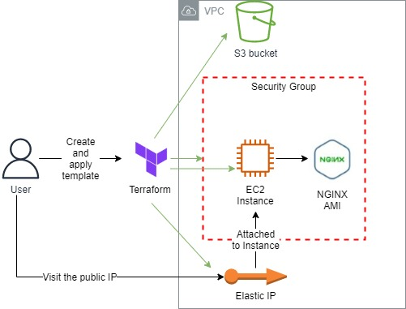
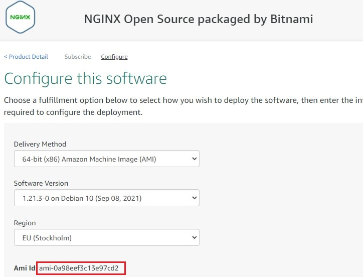
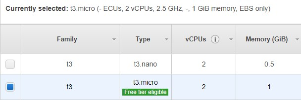
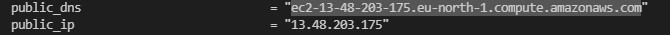
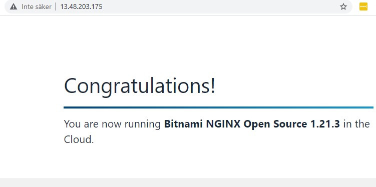
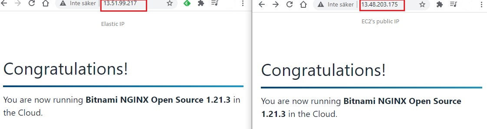
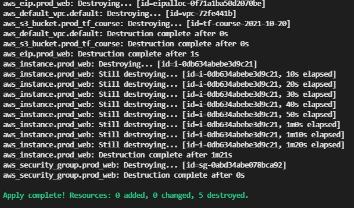

<br />

<p align="center">
  <a href="img/">
    
  </a>
  <h3 align="center">100 days in Cloud</h3>

<p align="center">
    Using Terraform launch a NGINX server on EC2 with Elastic IP 
    <br />
    Lab 72
    <br />
  </p>
</p>

<details open="open">
  <summary><h2 style="display: inline-block">Lab Details</h2></summary>
  <ol>
    <li><a href="#services-covered">Services covered</a>
    <li><a href="#lab-description">Lab description</a></li>
    </li>
    <li><a href="#lab-date">Lab date</a></li>
    <li><a href="#prerequisites">Prerequisites</a></li>    
    <li><a href="#lab-steps">Lab steps</a></li>
    <li><a href="#lab-files">Lab files</a></li>
    <li><a href="#acknowledgements">Acknowledgements</a></li>
  </ol>
</details>

---

## Services Covered
*  **Terraform**
*  **EC2 Instance**
*  **S3**

---

## Lab description
I'm learning the automation type of deployment in AWS, and even though that AWS has it's SAM tool I wanted to try something that's apparently more widely used and more powerful then that, that is Terraform.  In my first attempt I will create a terraform deployment using a NGINX server from AWS Marketplace.

* **Create a Terraform template**
* **Deploy Security Group, S3 bucket, EC2 Instance running NGINX**
* **Attach Elastic IP to the Instance**

### Lab date
20-10-2021

---

### Prerequisites
* AWS account
* A IAM User with programmatic access
* Terraform installed and on path

---

### Lab steps
1. Create a **credentials** file (no extension) in the same terraform folder and save it.

   ```tex
   [default]
   aws_access_key_id=YOUR_KEY
   aws_secret_access_key=YOUR_SECRET_KEY
   ```

2. Create a folder for you Terraform code. Create a terraform file with .tf extension (a tip: use Terraform extension in VSC, it will help you with proper formatting). I'll start small with deploying a S3 bucket:

   ```
   provider "aws" {
     profile = "default"
     region  = "<<YOUR_REGION>>"
   }
   
   resource "aws_s3_bucket" "prod_tf_course" {
     bucket = "tf-course-2021-10-20"
     acl    = "private"
   }
   ```

3.  In terminal (assuming that Terraform is on path) in the working folder run:

   ```
   terraform init
   ```

   and then apply it which deploy the resource (a S3 bucket in this case):

   ```bash
   terraform apply
   ```

   then answer **yes**. 

4. Now let's add more resources. I need a Security Group in my default VPC, allowing traffic on HTTP\HTTPS, add this code:

   ```
   resource "aws_default_vpc" "default" {}
   
   resource "aws_security_group" "prod_web" {
     name        = "prod_web"
     description = "allow standard http and https ports inbound everything outbound"
   
     ingress {
       from_port   = 80
       to_port     = 80
       protocol    = "tcp"
       cidr_blocks = ["0.0.0.0/0"]
     }
   ingress {
       from_port   = 443
       to_port     = 443
       protocol    = "tcp"
       cidr_blocks = ["0.0.0.0/0"]
     }
     egress {
       from_port   = 0
       to_port     = 0
       protocol    = "-1"
       cidr_blocks = ["0.0.0.0/0"]
     }
   ```

   and then run apply command that will show which additional resources will be created:

   ```
   terraform apply
   ```

5. Go to the AWS Marketplace and search for NGINX server, choose the one from Bitnami and copy the AMI ID:

   

6. Now let's add Instance resource to terraform template, for the Instance type choose the one that's Free Tier eligible in you region:

   

   ```
   resource "aws_instance" "prod_web" {
       ami           = "ami-0a98eef3c13e97cd2"
       instance_type = "t3.micro"
   
       vpc_security_group_ids = [
         aws_security_group.prod_web.id
       ]
   
       tags = {
       "Terraform" : "true"
     }
   }
   ```

   After adding those lines run

   ```
   terraform plan
   ```

   Which will present the changes made since last **terraform apply** it won't deploy the resources. To do that you run **terraform apply**

7. If you run **terraform show** it will print the deployed resources. Then under Instances public IP

   

   if you copy it and paste it in your browser you'll see NGINX server running:

   

8. Let's add an Elastic IP to the instance:

   ```
   resource "aws_eip" "prod_web" {
     instance = aws_instance.prod_web.id
   
     tags = {
       "Terraform" : "true"
     }
   }
   ```

   And apply. Then run 

   ```
   terraform show
   ```

   to get the elastic IP address.

   

9. In order to destroy the resource you might want to run plan and see what's needed to be done by terraform, and save the output to a file:

   ```bash
   terraform plan -destroy -out destroy.plan
   ```

   Then apply that plan:

   ```bash
   terraform apply destroy.plan
   ```

   

   

---
### Lab files
* [terraform template](prod.tf)
* 


---

### Acknowledgements

* 

