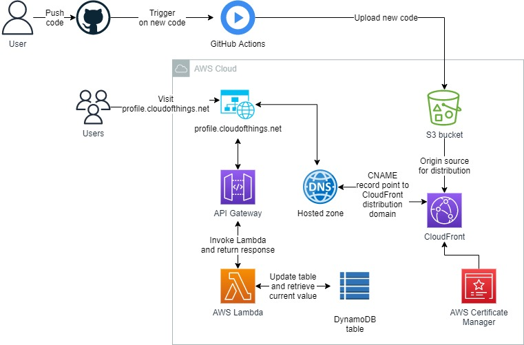
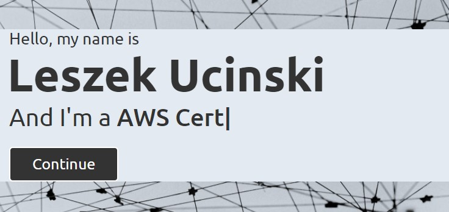

<br />

<p align="center">
  <a href="img/">
    
  </a>


  <h3 align="center">100 days in Cloud</h3>

<p align="center">
    Part One of Cloud Resume Challenge:
   S3 hosted static website with API backed visitors count with CloudFront distribution
    <br />
    Lab 73
    <br />
  </p>


</p>

<details open="open">
  <summary><h2 style="display: inline-block">Lab Details</h2></summary>
  <ol>
    <li><a href="#services-covered">Services covered</a>
    <li><a href="#lab-description">Lab description</a></li>
    </li>
    <li><a href="#lab-date">Lab date</a></li>
    <li><a href="#prerequisites">Prerequisites</a></li>    
    <li><a href="#lab-steps">Lab steps</a></li>
    <li><a href="#lab-files">Lab files</a></li>
    <li><a href="#acknowledgements">Acknowledgements</a></li>
  </ol>
</details>

---

## Services Covered
*  **CloudFront**
*  **Lambda**
*  **S3**
*  **API Gateway**
*  **DynamoDB**
*  **Certificate Manager**


---

## Lab description
As I write in my blog [post](https://cloudofthings.net/cloud-resume-challenge-part-one/) I'm participating in [Cloud Resume Challenge](https://cloudresumechallenge.dev/). I will describe the steps necessary for the first part of the deployment, mainly the manual steps to get the website running. Ordering of my steps is bit random, I was making few things at the same time, testing, adjusting the code but it's all there. So proceed in your own fashion.


* **Create website**
* **Make website globally and securely  available**
* **Create a visitors counter**
* **Set up GitHub actions**

### Lab date
19-10-2021

---

### Prerequisites
* AWS account
* GitHub account for deploying the code
* A website of your own
* I recommend using Visual Studio Code with [Live Server](https://marketplace.visualstudio.com/items?itemName=ritwickdey.LiveServer) extension - it'll make your life so much easier
* Postman for API testing

---

### Lab steps
1. I'm not going to describe the process of building the website or creating the content, it's only up to one how she wants the Resume to look like. [Here's](https://github.com/CloudedThings/aws-crc-frontend) the code to mine. What's important is to include a script in the html file that will make request calls to the API, it might look something like that:

   ```javascript
   <script type = "text/javascript">
        var apiUrl = "<<YOUR-API-ENDPOINT";
        	fetch(apiUrl)
        	.then(response => response.json())
        	.then(data =>{
        var count = document.getElementById('body');
           count.innerHTML = data.body;
           console.log(data)});
   </script>
   ```

   What it basically does is fetching the response from API that returns json object with a value body corresponding to the visitors count logged in DynamoDB.

2. At this point I started to test the website. I created a S3 bucket with **Static website hosting** enabled. I knew that my website would be hosted in my LightSail DNS hosted zone, so I had to call the bucket accordingly. In my case the domain for the resume is [profile.cloudofthings.net](https://profile.cloudofthings.net/) so that's how I called it. Originally I made the bucket public in order to be able to test it, but that's not necessary with CloudFront distribution (more on that later). 

3. It was time to create resources necessary for the visitors counter. I started with a DynamoDB table. I have to admit that it took me couple of tries before I figured out what works best with Lambda function. But eventually I landed on having only one Item with **Primary partition key** *id* and additional **Attribute** *visits*.

4. Creating [Lambda function](https://github.com/CloudedThings/aws-crc-backend/blob/main/python_scripts/lambda.py) and working with the code and testing it in my opinion the fun part, even though it might be frustrating. But what doesn't kill you makes you stronger! Anyways I created the **Environment variable** for the table name, something I've learned is a good practice at all times. In order to reduce the amount of Lambda invocations (even though I'm definitely not gonna be overflowed with visitors any time soon) I created a method within the code that returns the latest value from the table after it gets incremented. So what's happening in the code is that first the lambda connects to the table, update the item by increment of 1 and then return API valid response with status code, headers and finally calls the earlier mentioned method to retrieve current value and pass it in response to API.

5. Next step was to create and deploy Gateway API. I needed only the GET method with Lambda integration. I tried to make it as restricted as I could, so that only my page could make requests to the endpoint. Obviously the endpoint I have in index.html is the one to the API created in this step. 

6. At this point (not as smooth as I described though, there's alway a policy or role that one forgets to assign, right?) the website was up, script was making request to API, that invoked the Lambda function and she did her part on DynamoDB.

7. Last step in Part One, or manual deployment if you wish was to set up a CloudFront distribution. My [cloudofthings.net](https://cloudofthings.net/) runs on LightSail with CloudFront distribution, so I included the profile.cloudofthings.net domain as custom domain. A SSL certificate was needed but the AWS Certificate Manager makes it very easy to create one and validate domain. There's one neat thing a found out making the CloudFront distribution, if S3 bucket is origin for one you can create **Origin access identity** and keep the bucket private, while CloudFront will still be able to make getS3 object requests. Another finding was that as **Viewer protocol policy** I needed to choose **Redirect HTTP to HTTPS** and couldn't really figure out what restricted me from choosing **HTTPS only**. Well it works as it should.

<p align="center">
  <a href="img/">
    
  </a>
</p>


---
### Lab files
* [Frontend-GitHub-Repository](https://github.com/CloudedThings/aws-crc-frontend)
* [Backend-GutHub-Repository](https://github.com/CloudedThings/aws-crc-backend)


---

### Acknowledgements

* [CRC Challenge](https://cloudresumechallenge.dev/)

