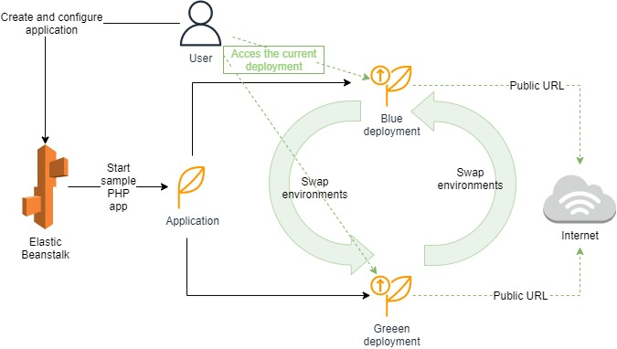
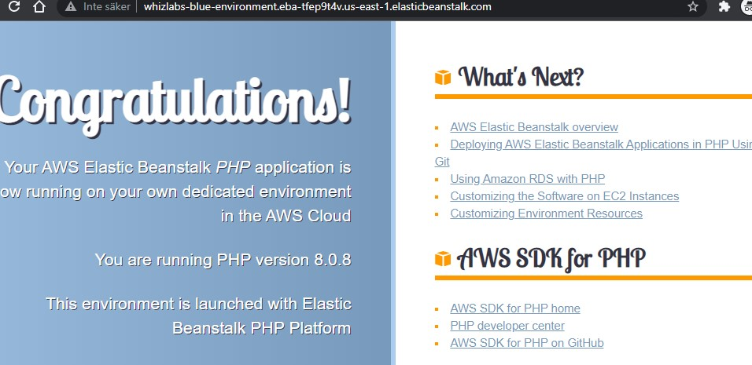
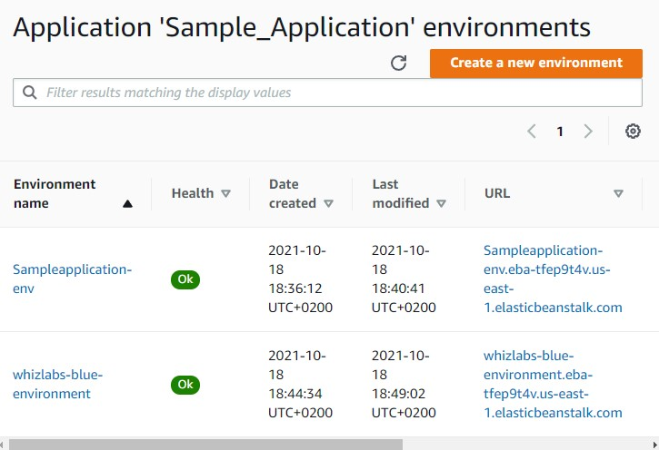
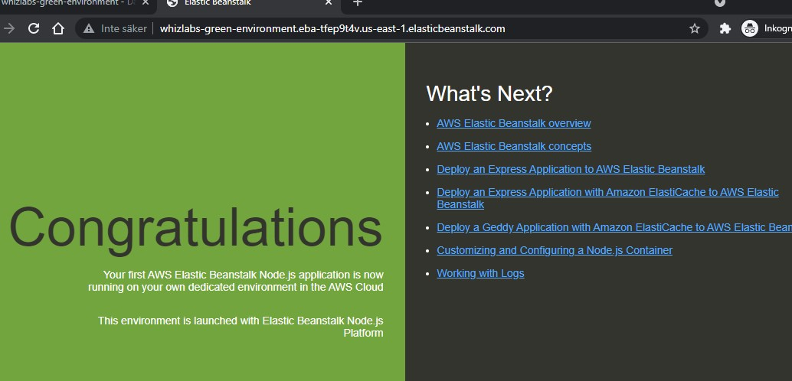
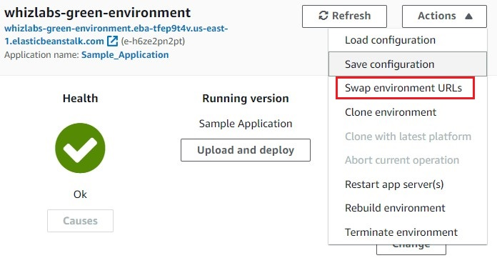
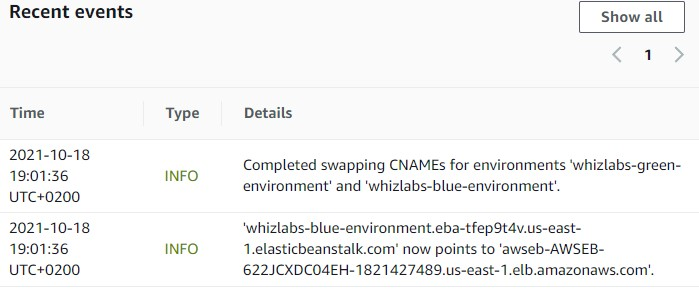
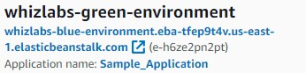

 

  

  <h3 align="center">100 days in Cloud</h3>

    Blue/Green deployment in Elastic Beanstalk
     
    Lab 74
     
  

  
<h2 style="display: inline-block">Lab Details</h2>

  <ol>
    <li><a href="#services-covered">Services covered</a>
    <li><a href="#lab-description">Lab description</a></li>
    </li>
    <li><a href="#lab-date">Lab date</a></li>
    <li><a href="#prerequisites">Prerequisites</a></li>    
    <li><a href="#lab-steps">Lab steps</a></li>
    <li><a href="#lab-files">Lab files</a></li>
    <li><a href="#acknowledgements">Acknowledgements</a></li>
  </ol>

---

## Services Covered
*  **ElasticBeanstalk**

---

## Lab description
This lab goes through the steps of setting up a Blue/Green deployment in Elastic Beanstalk. It incudes launching a sample PHP application and realising an update to it in Blue/Green deployment, which will create a new parallel environment. 

* **Create application in Elastic Beanstalk**
* **Deploy two versions of applications**
* **Swapping between environments**

### Lab date
18-10-2021

---

### Prerequisites
* AWS account

---

### Lab steps
1. Create an application in Elastic Beanstalk. Choose **PHP** as platform and use a sample application. *This will take couple of minutes*.

2. When done, go to the **Applications** and choose yours. Then in **Actions** drop-down menu choose **Create a new environment**, then **Web server** tier. Give it a name indicating that it's a **Blue** deployment and choose **PHP** as platform. Click on **Create environment**. This will create a new environment after a while.

3. Once the new environment is provisioned you can open the URL with running PHP application. 

   

   There will be two environments of your application:

   

4. Now create one more environment. This time it'll be a **Green** deployment and with Node.js as platform.

   

5. Now that two environments are created it's time to **swap the URLs** pointing to the one that you wish to test. Choose the **Green** environment and in **Actions** menu select **Swap Environment URLs**. Choose the **blue** environment from the dropdown menu and select it as a one to swap. 

   

   

6. Note that even though that we're working with the green environment it has the blue's URL now:

   

7. Next step will be setting up Route53 CNAME addresses pointing to those environments and maybe realising apps for testing.

8. Delete application afterwards.

---
### Lab files

---

### Acknowledgements

* [Whizlabs](https://play.whizlabs.com/site/task_details?lab_type=1&task_id=118&quest_id=36)

