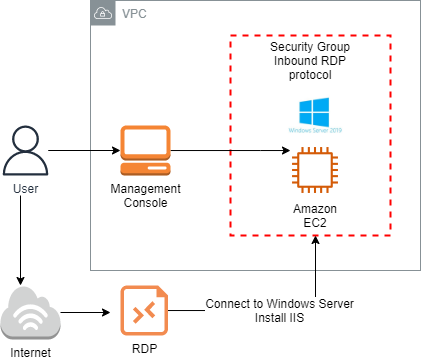
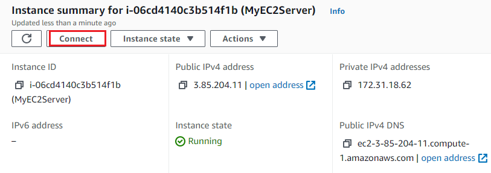
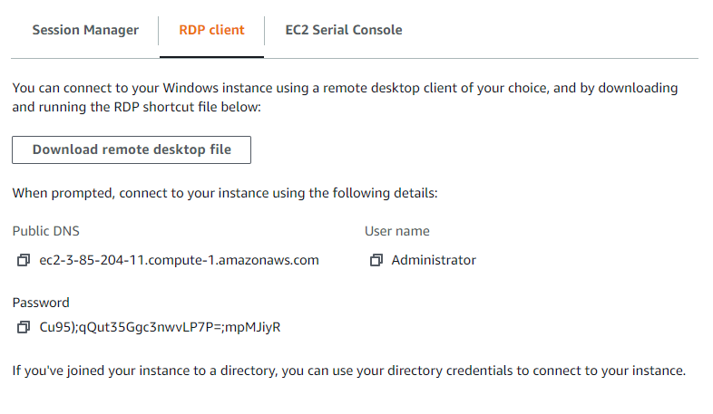
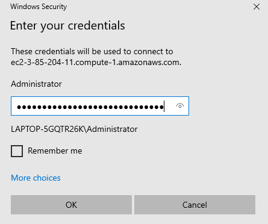
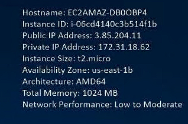
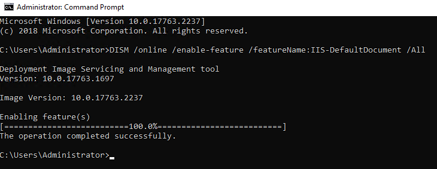
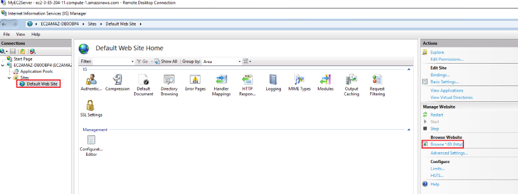
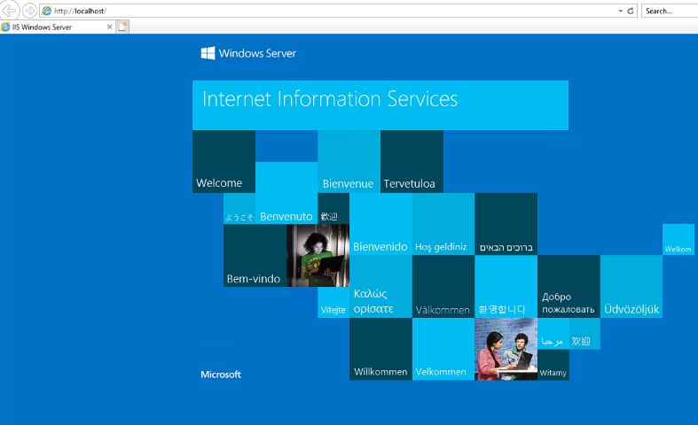
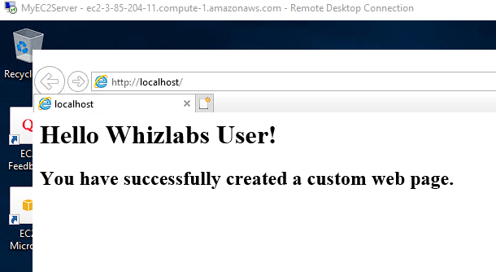

<br />

<p align="center">
  <a href="img/">
    
  </a>


  <h3 align="center">100 days in Cloud</h3>

<p align="center">
    Create EC2 Instance and Connect to a Windows machine using RDC
    <br />
    Lab 75
    <br />
  </p>


</p>

<details open="open">
  <summary><h2 style="display: inline-block">Lab Details</h2></summary>
  <ol>
    <li><a href="#services-covered">Services covered</a>
    <li><a href="#lab-description">Lab description</a></li>
    </li>
    <li><a href="#lab-date">Lab date</a></li>
    <li><a href="#prerequisites">Prerequisites</a></li>    
    <li><a href="#lab-steps">Lab steps</a></li>
    <li><a href="#lab-files">Lab files</a></li>
    <li><a href="#acknowledgements">Acknowledgements</a></li>
  </ol>
</details>

---

## Services Covered
*  **EC2**

---

## Lab description
Create and connect to a EC2 Instance running a Windows Server 2019 AMI. Then connect to it it from your machine using RDC. Install **Internet Information Services**. Create a custom webpage and host it on that EC2 Instance


* **Create EC2 Windows AMI Instance**
* **Create Key Pair for RDC**
* **Connect to Windows Server on EC2 using RDC**
* **Install IIS on Windows Server**
* **Create and host a webpage on EC2 Windows machine using IIS**

### Lab date
17-10-2021

---

### Prerequisites
* AWS account

---

### Lab steps
1. In the AWS Console go to the EC2 section and launch EC2 Instance with Windows Server 2019 Base AMI of type t2.micro. Under **Security Group** section create a new SG with RDP (Remote Desktop Connection) from you IP address. Create a RSA key pair and download it. 

2. When the instance's state changes to *running*, go to the instance details and click on **Connect**

   

   Choose **RDP client ** and upload the downloaded key. Click on **Decrypt Password**, a user name and password will be displayed.

   

3. On your computer use a Remote Desktop application, download it if it's not installed. Use the **Download remote desktop file** it'll automatically fills in the connection details, and provide password from the console.

   

   You will be connected to the Windows Server, it's details are displayed on the screen.

   

   

4. On your Windows Server machine install an IIS server so that it can launch a web page. Open a Command Prompt and run in as administrator, then run this command:

   ```bash
   DISM /online /enable-feature /featureName:IIS-DefaultDocument /All
   ```

   

   This will install the Internet Information Services.

5. In the start menu open the IIS. Then continue to **Default Web Site** and click on **Browse:*80 (http)** this will open the default web page in localhost mode. 

   

   

6. Create a Custom Web Page. Open notepad and create a sample html website. Save it as index.html.

   ```html
   <html>
   
   <body>
   
   <h1>Hello to CloudOfThings.net!</h1>
   
   <h2>You have successfully created a custom web page.</h2>
   
   </body>
   
   </html>
   ```

   Save it on disc C in folder *inetpub > wwwroot*. 

7. Now when you refresh the locally hosted website you will see the content of index.html in the browser.

   

---
### Lab files


---

### Acknowledgements

* [Whizlabs](https://play.whizlabs.com/site/task_details?lab_type=1&task_id=80&quest_id=35)

