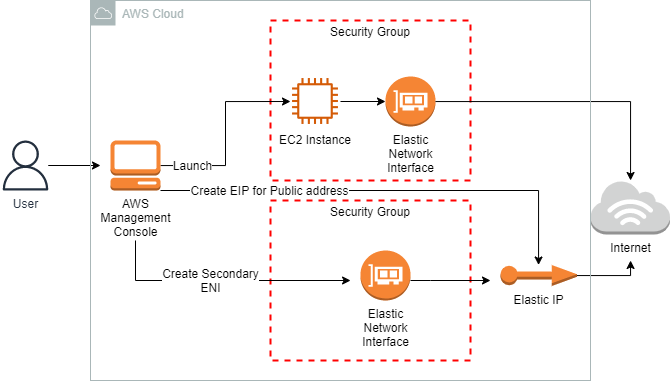
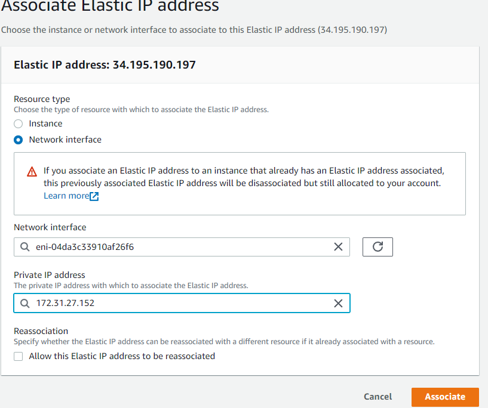
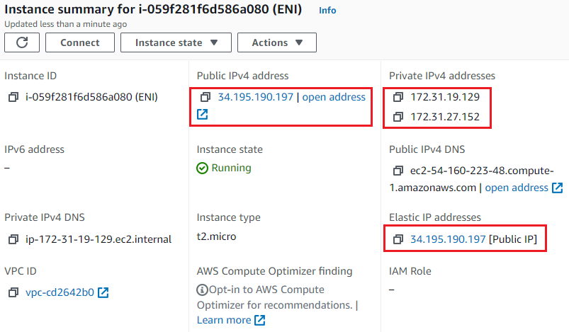
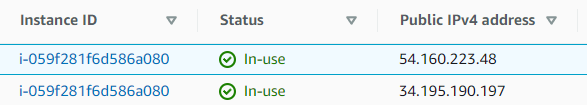

<br />

<p align="center">
  <a href="img/">
    
  </a>


  <h3 align="center">100 days in Cloud</h3>

<p align="center">
    Create Elastic Network Interface - Multiple IPs on an EC2
    <br />
    Lab 76
    <br />
  </p>


</p>

<details open="open">
  <summary><h2 style="display: inline-block">Lab Details</h2></summary>
  <ol>
    <li><a href="#services-covered">Services covered</a>
    <li><a href="#lab-description">Lab description</a></li>
    </li>
    <li><a href="#lab-date">Lab date</a></li>
    <li><a href="#prerequisites">Prerequisites</a></li>    
    <li><a href="#lab-steps">Lab steps</a></li>
    <li><a href="#lab-files">Lab files</a></li>
    <li><a href="#acknowledgements">Acknowledgements</a></li>
  </ol>
</details>

---

## Services Covered
*  **EC2**

---

## Lab description
The lab goes through a process of creating an Amazon EC2 Instance, Security Groups, Elastic IP and additional Elastic Network Interface. The Instance will be run with initial user data scripts that will install Apache httpd with sample webpage. Elastic IP and ENI will be attached to the Instance which will result with two public IP's attached to the same Instance.


* **Create EC2 Instance**
* **Create Elastic IP**
* **Create additional Elastic Network Interface**
* **Create Security Groups for Instance and ENI**
* **Attach Elastic IP to ENI**

### Lab date
16-10-2021

---

### Prerequisites
* AWS account

---

### Lab steps
1. Create a Security Group for the EC2 Instance. Create it in default VPC and andd HTTP inbound rule for all IP addresses. 

2. Create a SG for the Network Interface with similar Inbound rule.

3. Launch a Amazon Linux 2 AMI machine of type t2.micro. And provide following **User data** that will install and run Apache httpd web server:

   ```bash
   #!/bin/bash
   
   sudo su
   
   yum update -y
   
   yum install -y httpd
   
   systemctl start httpd
   
   systemctl enable httpd
   
   echo "<html> <h1> Response coming from server </h1> </ html>" > /var/www/html/index.html
   ```

   Attach the earlier created SG to the Instance. When launched copy hte subnet ID ans Availability zone.

4. Create a Network interface and attach it with EC2 Instance. Under **Network & Security** go to Network interface and create one in the same subnet and availability zone as EC2 instance. For the security group use the one created earlier. Attach the network interface with EC2 instance by choosing **Attach** form **Actions** drop-down menu.

5. Allocate an Elastic IP address. Don't need to make any changes, click on Allocate and then Associate EIP to the the Network interface

   

   Go to the EC2 Instance and you should see the EIP attached to it.

   

6. Navigate to **Network interfaces** and you'll find to **Public IPv4 addresses** attached to the same Instance

   

   Paste them in your browser tab and you'll receive the same respond from httpd running on the machine.

---
### Lab files


---

### Acknowledgements

* [Whizlabs](https://play.whizlabs.com/site/task_details?lab_type=1&task_id=231&quest_id=36)

