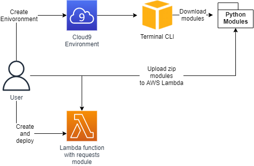
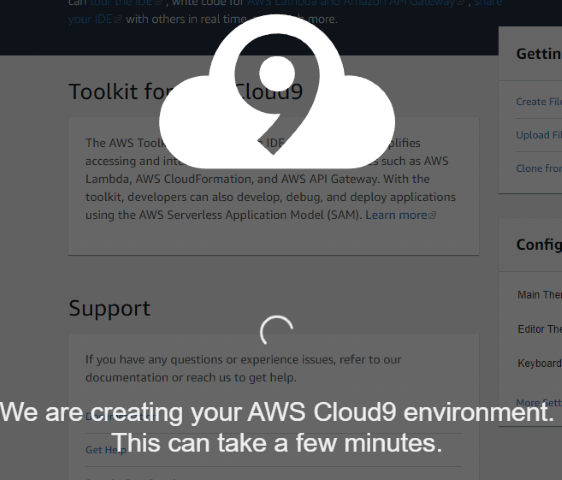
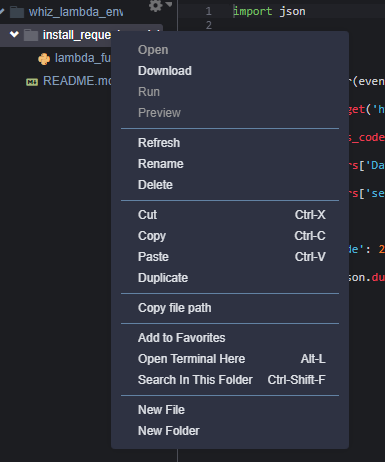

<br />

<p align="center">
  <a href="img/">
    
  </a>


  <h3 align="center">100 days in Cloud</h3>

<p align="center">
    Install Python module for Lambda using Cloud9
    <br />
    Lab 77
    <br />
  </p>


</p>

<details open="open">
  <summary><h2 style="display: inline-block">Lab Details</h2></summary>
  <ol>
    <li><a href="#services-covered">Services covered</a>
    <li><a href="#lab-description">Lab description</a></li>
    </li>
    <li><a href="#lab-date">Lab date</a></li>
    <li><a href="#prerequisites">Prerequisites</a></li>    
    <li><a href="#lab-steps">Lab steps</a></li>
    <li><a href="#lab-files">Lab files</a></li>
    <li><a href="#acknowledgements">Acknowledgements</a></li>
  </ol>
</details>

---

## Services Covered
*  **Lambda**
*  **Cloud9**

---

## Lab description
For a Lambda function to work with request library it needs to be uploaded as a separate module. To do that a new Cloud9 environment will be started and in it a pip commands executed in terminal. Then modules will be packed and upload to lambda function.


* **Create a Lambda function**
* **Create Cloud9 environment**
* **Download packages using Terminal and pip**
* **Upload libraries in to Lambda**

### Lab date
15-10-2021

---

### Prerequisites
* AWS account

---

### Lab steps
1. Create a new Lambda function with Python som runtime.

   ```
   import json
   
   import requests
   
    
   def lambda_handler(event, context):
   
       r = requests.get('https://github.com') 
   
       print(r.status_code)
   
       print(r.headers['Date'])
   
       print(r.headers['server'])
   
       return {
   
           'statusCode': 200,
   
           'body': json.dumps('success')
   
       }
   ```

   If you try and test it will respond with error message because **request** package is not part of Lambda Python standard library. 

2. Go to **Cloud9** and create a new environment. Choose *direct access* with EC2 instance. This will take some time:

   

3. Import the Lambda function to Cloud9. On the left side click on  then choose your Lambda and *install_request_module* then download.

4. Install request library in Terminal:

   

5. Run those commands:

   ```
   pip install --target ~/environment/<<LAMBDA NAME>>/ requests
   ```

   Then to zip the library run:

   ```
   zip -r ../my-deployment-package.zip *
   ```

   Download that zip file

6. Back in Lambda upload that zip package and test your function:

   

7. Delete your environment in Cloud9.

---
### Lab files

* [lambda.py](lambda.py)

---

### Acknowledgements

* [Whizlabs](https://play.whizlabs.com/site/task_details?lab_type=1&task_id=268&quest_id=31)

