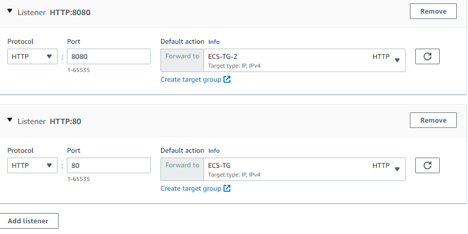
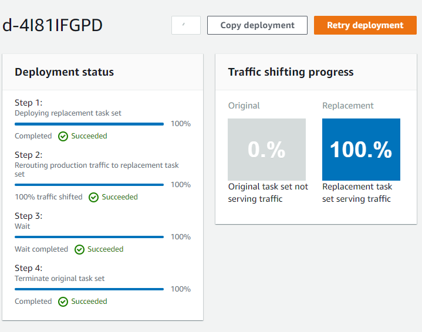
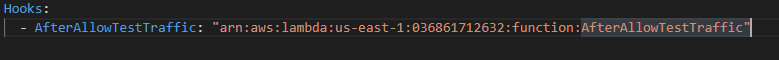

<br />

<p align="center">
  <a href="img/">
    
  </a>


  <h3 align="center">100 days in Cloud</h3>

<p align="center">
    Create and deploy application on Elastic Container Service using CodeDeploy and CloudShell
    <br />
    Lab 78
    <br />
  </p>


</p>

<details open="open">
  <summary><h2 style="display: inline-block">Lab Details</h2></summary>
  <ol>
    <li><a href="#services-covered">Services covered</a>
    <li><a href="#lab-description">Lab description</a></li>
    </li>
    <li><a href="#lab-date">Lab date</a></li>
    <li><a href="#prerequisites">Prerequisites</a></li>    
    <li><a href="#lab-steps">Lab steps</a></li>
    <li><a href="#lab-files">Lab files</a></li>
    <li><a href="#acknowledgements">Acknowledgements</a></li>
  </ol>
</details>

---

## Services Covered
*  **Application Load Balancer**
*  **CodeDeploy**
*  **Amazon ECS**
*  **CloudShell**
*  **Lambda**
*  **CloudWatch**

---

## Lab description
Using the CloudShell CLI create a ECS Cluster and deploy an app onto it using CodeDeploy. Create an Application Load Balancer to distribute traffic to HTTP port for the ECS Cluster. Create Target Group for that ALB and a Security Group. Deploy application in CodeDeploy, then create Lambda function and add new  revision that contains Hooks to that function.


* **Create Application Load Balancer**
* **Create Security Group**
* **Create Target Group for ECS Cluster**
* **Create a ECS Cluster on ECS**
* **Create ECS Task**
* **Deploy application using CodeDeploy onto ECS**
* **Update the ECS task definition**

---

### Lab date
14-10-2021

---

### Prerequisites
* AWS account

---

### Lab steps
1. Create a SecurityGroup for a Load Balancer. Allow all inbound traffic of type TCP from any IPv4 address. 

2. Create a Application Load Balancer. Choose **Internet-facing**, **ipv4**, Listener on port 80 and add new listener on port 8080. Create a new target group for that listener of type IP addresses. And similarly for listener on port 80 

   

3. Create a new IAM role with [policy](task-role-policy.json) from that file. Copy its ARN.

4. Open CloudShell. Create a ECS Cluster:

   

   ```
   aws ecs create-cluster --cluster-name tutorial-bluegreen-cluster --region us-east-1
   ```

   Download [fargate-task.json](fargate-task.json) and paste the created IAM Role's ARN 

   

   Upload the [fargate-task.json](fargate-task.json) to S3.  Copy objects S3 URI.

5. Back in CloudShell replaced the copied S3 URI and 

   ```
   aws s3 cp s3://whizlabs.38916.84749913/fargate-task.json .
   ```

   Don't miss the dot at the end. This command will copy the S3 object to working directory for CloudShell.

6. Register the task definition by running the below command in CloudShell:

   ```
   aws ecs register-task-definition --cli-input-json file://fargate-task.json --region us-east-1
   ```

   

7. Back in EC2 go to **Target group** and copy the first TG ARN. Download the [service-bluegreen.json](service-bluegreen.json) file and replace the **targetGroupArn** with ARN od first target group. Then Replace **securityGroups** ID with Security Group created earlier. And finally paste all the subnets you ALB is available in. Upload that file to the same S3 bucket you used earlier. Now copy its S3 URI. Now you need to copy that file to working folder in CloudShell

   

   ```
   aws s3 cp s3://whizlabs.38916.84749913/service-bluegreen.json .
   ```

   And then register the task definition by runnig this command:

   ```
   aws ecs create-service --cli-input-json file://service-bluegreen.json --region us-east-
   ```

   Copy the task definitions ARN from output. By now the ECS cluster running 1 task should apear in Console

   

   

8. Download the [appspec.yml](appspec.yml). In that file replace the **TaskDefinition** with ARN of the one copied earlier. Upload it to the S3 bucket. Copy its S3 URI. 

9. Create a new application in CodeDeploy. As a compute platform choose **Amazon ECS**.

10. Create deployment group. Use you existing ECS cluster and service. Provide the values of the ALB under **Load balancers** and Target Groups created earlier. In **Deployment settings** choose *Reroute traffic immediately*, *ECSAllAtOnce* and change the time to 5 minutes.

11. Click on **Create deployment**. In settings past S3 URI of appspec.yml object from S3 bucket uploaded earlier. This will start deployment of the app on ECS. This will take some time since there's 5 minutes wait before switching the traffic.

    

12. In ECS Task Definition create a new revision by simply adding new tags.

13. In EC2 under Load Balancer copy ALB ARN and Target Groups ARN, then run:

    ```
    aws elbv2 create-listener --load-balancer-arn arn:aws:elasticloadbalancing:us-east-1:036861712632:loadbalancer/app/ECS-LB/1b22550d7dfcf7ff --protocol HTTP --port 8080 --default-actions Type=forward,TargetGroupArn=arn:aws:elasticloadbalancing:us-east-1:036861712632:targetgroup/ECS-TG/adb9616944216202 --region us-east-1
    ```

14. Create a Lambda function for the AfterAllowTestTraffic event.

15. Download [AfterAllowTestTraffic.js](AfterAllowTestTraffic.js) and upload it to S3 bucket. Then copy it to the CLoudShell.

    ```
    aws s3 cp s3://whizlabs.38916.84749913/AfterAllowTestTraffic.js .
    ```

    zip the file:

    ```
    zip AfterAllowTestTraffic.zip AfterAllowTestTraffic.js
    ```

    Create a Lambda function, replace the role with the one you created for it:

    ```
    aws lambda create-function --function-name AfterAllowTestTraffic \
           --zip-file fileb://AfterAllowTestTraffic.zip \
           --handler AfterAllowTestTraffic.handler \
           --runtime nodejs10.x \
           --role  arn:aws:iam::036861712632:role/lambda-cli-hook-role 
    ```

    Copy the functions ARN.

16. Open the appspec.yml and add this Hook:

    

    Update the definition version and update it to the S3 bucket. Copy its S3 URI.

17. In the Application tab in CodeDeploy update the application by editing it and providing the updated appspec.yml. Edit the Deployment group and choose the second listener port **8080** and create deployment.

    

18. Check the final outpu in the CloudWatch log under **/aws/lambda/AfterAllowTestTraffic**

    

    The deployment passed the **AfterAllowTraffic**. Delete all the created resources after checking the CloudWatch logs.

    

    

---
### Lab files

* [fargate-task.json](fargate-task.json) - Fargate task 
* [service-bluegreen.json](service-bluegreen.json) - CodeDeploy deployment
* [AfterAllowTestTraffic.js](AfterAllowTestTraffic.js) - Lambda function for new revision
* [task-role-policy.json](task-role-policy.json) - IAM policy for ECS Task

---

### Acknowledgements

* [Whizlabs](https://play.whizlabs.com/site/task_details?lab_type=1&task_id=268&quest_id=31)

