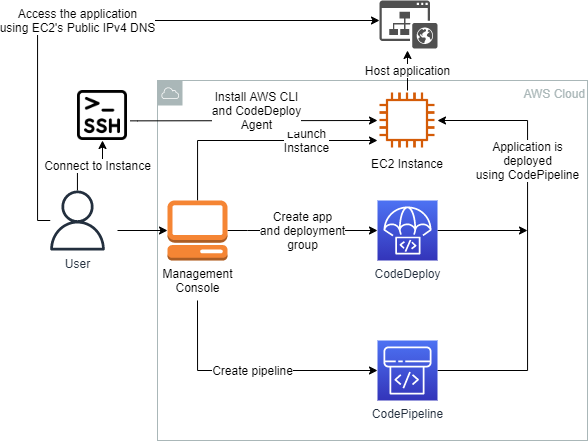
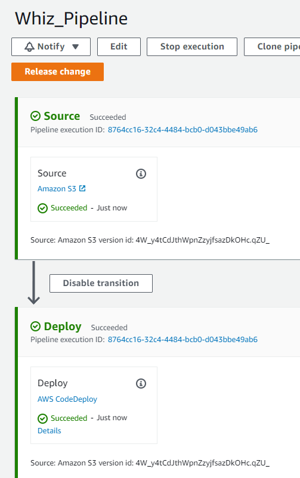
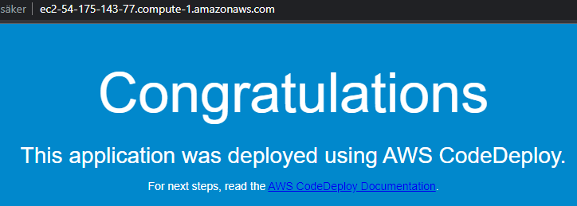

<br />

<p align="center">
  <a href="img/">
    
  </a>


  <h3 align="center">100 days in Cloud</h3>

<p align="center">
    Create and deploy application using CodeDeploy and Codepipeline
    <br />
    Lab 79
    <br />
  </p>


</p>

<details open="open">
  <summary><h2 style="display: inline-block">Lab Details</h2></summary>
  <ol>
    <li><a href="#services-covered">Services covered</a>
    <li><a href="#lab-description">Lab description</a></li>
    </li>
    <li><a href="#lab-date">Lab date</a></li>
    <li><a href="#prerequisites">Prerequisites</a></li>    
    <li><a href="#lab-steps">Lab steps</a></li>
    <li><a href="#lab-files">Lab files</a></li>
    <li><a href="#acknowledgements">Acknowledgements</a></li>
  </ol>
</details>

---

## Services Covered
*  **Amazon EC2**

*  **CodeDeploy**

*  **CodePipeline**

---

## Lab description
This labs walks through a process of creating a two-stage pipeline that uses sample application. Process includes launching an EC2 Instance, installing a CodeDeploy Agent, creating CodeDeploy application and Deployment and then creating a CodePipeline pipeline to initiate the process.


* **Launch EC2 Instance**
* **SSH to Instance, install CodeDeploy Agent**
* **Create CodeDeploy application and Deployment**
* **Create a CodePipeline pipeline and test application**

---

### Lab date
13-10-2021

---

### Prerequisites
* AWS account
* putty for SSH connection

---

### Lab steps
1. Start with launching an EC2 Instance of type t2.micro with Amazon Linux. It will need a IAM Role that will allow CodeDeploy to perform a action on it and access to S3. Create a new Security Group and allow HTTP connections from *anywhere*. When the instance's status changes to *Running* note down its the IPv4 Public IP Address.

2. SSH into EC2 Instance. Instal AWS CLI and CodeDeploy Agent. Switch to root user:

   ```
   sudo su
   ```

   Run updates:

   ```
   yum -y update
   ```

   To install Codedeploy agent we need Ruby:

   ```
   yum install ruby wget -y
   ```

   ```
   wget https://aws-codedeploy-us-east-1.s3.us-east-1.amazonaws.com/latest/install
   ```

   Change the permission of the installer and install agent

   ```
   chmod +x ./install
   ```

   ```
   sudo ./install auto
   ```

   To check agents status run:

   ```
   service codedeploy-agent status 
   ```

3. Upload a [sample app](src/SampleApp_Linux.zip) to a S3 bucket. 

4. Create a CodeDeploy application and Deployment group. Start with creating application and choose *EC2/On-premises* as platform. Create a deployment group and choose the service role from drop-down menu. In **Environment configuration** choose Amazon EC2 instances and since CodeDeploy Agent is already install choose *Never* in **Agent configuration**. And uncheck **Load balancer**.

5. Create a pipeline and deploy application on the instance in CodePipeline. In pipeline settings choose *New service role* in **Advanced settings** in *Artifact store* choose *Custom location* and provide name of the bucket with sample application. In next step choose Amazon S3 as a source provider and uploaded zip file. Skip the build stage, and as **Deploy provider** choose AWS CodeDeploy, created app and Deployment. Click on Create, this will run the pipeline.

   

6. Time for testing. Go back to EC2 Instance and visit the Public IPv4 DNS address.



7. Time for clean-up. Delete the CodeDeploy application, terminate the EC2 Instance.

---
### Lab files

* SampleApp_Linux.zip

---

### Acknowledgements

* [Whizlabs](https://play.whizlabs.com/site/task_details?lab_type=1&task_id=77&quest_id=36)

