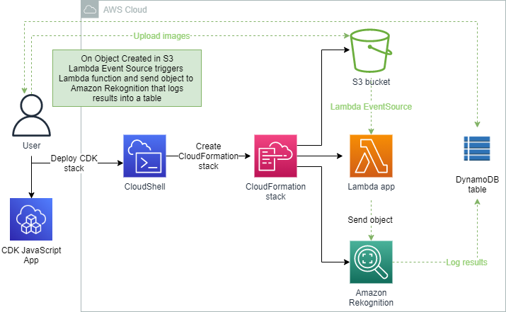
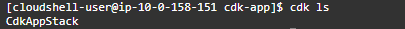
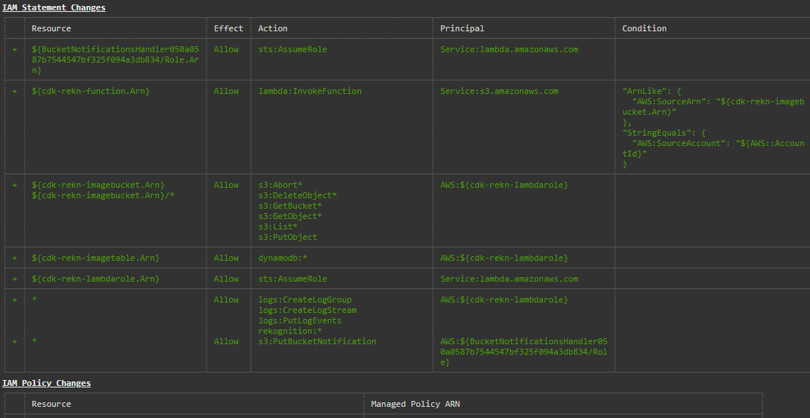
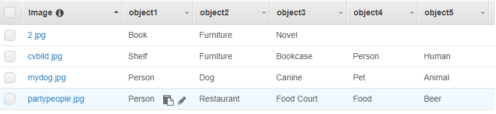

<br />

<p align="center">
  <a href="img/">
    
  </a>

  <h3 align="center">100 days in Cloud</h3>

<p align="center">
    Using CDK deploy Lambda function to send images to Amazon Rekognition and log results in DynamoDB
    <br />
    Lab 80
    <br />
  </p>


</p>

<details open="open">
  <summary><h2 style="display: inline-block">Lab Details</h2></summary>
  <ol>
    <li><a href="#services-covered">Services covered</a>
    <li><a href="#lab-description">Lab description</a></li>
    </li>
    <li><a href="#lab-date">Lab date</a></li>
    <li><a href="#prerequisites">Prerequisites</a></li>    
    <li><a href="#lab-steps">Lab steps</a></li>
    <li><a href="#lab-files">Lab files</a></li>
    <li><a href="#acknowledgements">Acknowledgements</a></li>
  </ol>
</details>

---

## Services Covered
*  **AWS CDK**

*  **CloudFormation**

*  **CloudShell**

---

## Lab description
In this lab a CDK stack will be created to provide a rekognition service and log result in DynamoDB. JavaScript will be used to create a [cdk-app-stack.js](cdk-app-stack.js) to create constructs for S3 bucket to upload images, on Object Created in S3 a Lambda Event Source will trigger Lambda function written in Python that will send that object to Amazon Rekognition and log results to DynamoDB table.


* **Write CDK stack in JavaScript**
* **Deploy CDK stack using CloudShell**
* **Write Lambda app to send objects from S3 to Amazon Rekognition**

---

### Lab date
12-10-2021

---

### Prerequisites
* AWS account

---

### Lab steps
1. Choose a region that supports both AWS CloudShell and Amazon Rekognition. Open CloudShell and run:

   ```bash
   sudo npm install -g aws-cdk
   ```

   This will install CDK.

2. Create a folder for the app and into it:

   ```bash
   mkdir cdk-app
   ```

   ```bash
   cd cdk-app
   ```

3. Initialize CDK project template for JavaScript:

   ```bash
   cdk init --language javascript
   ```

4. Check if everything got created:

   ```bash
   cdk ls
   ```

   

5. Install the necessary packages:

   ```bash
   npm install @aws-cdk/aws-s3 @aws-cdk/aws-iam @aws-cdk/aws-lambda @aws-cdk/aws-lambda-event-sources @aws-cdk/aws-dynamodb
   ```

6. Update the cdk-app-stack.js in lib directory

   ```
   cd lib/
   ```

   ```
   rm cdk-app-stack.js
   ```

   ```
   touch cdk-app-stack.js
   ```

   ```
   nano cdk-app-stack.js
   ```

   And copy contents of the [cdk-app-stack.js](cdk-app-stack.js). If nano is not installed run 

   ```
   sudo yum install nano
   ```

   This code will create constructs for S3 bucket, IAM Role, Lambda function, Lambda EventSource and DynamoDB. 

7. Leave the lib directory

   ```
   cd ../
   ```

   Create a new directory for lambda function

   ```
   mkdir lambda
   ```

   Create index.py file

   ```
   touch index.py
   ```

   And paste the code from [index.py](index.py)

   ```
   nano index.py
   ```

8. Go one level up from lambda

   ```
   cd ../
   ```

   then bootstrap the CDK applications:

   ```
   cdk bootstrap
   ```

   This will create a CloudFormation stack and deploy a S3 bucket.

9. Time to deploy the CDK defined resources, a CloudFormation stack will be created yet again and resources deployed.

   

   When CdkAppStack in CloudFormation gets created it's time for testing

10. Upload some images to the newly created S3 bucket. That worked very nicly for me, after uploading some images of books, myself, my dog and group of friends having dinner those results were logged into DynamoDB table:

    

11. Time for clean-up. Empty the S3 bucket and then in CloudBash run:

    ```
    cdk destroy
    ```

    This will delete the CloudFormation stack and all the created resources.


---
### Lab files

* cdk-app-stack.js
* index.py

---

### Acknowledgements

* [AWS Certified Developer course on Udemy](https://udemy.com)

