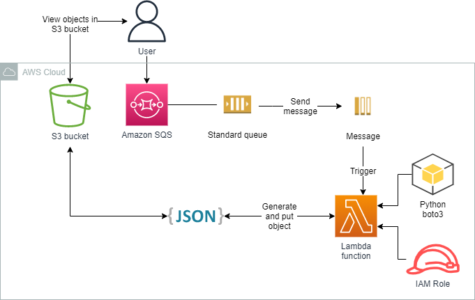
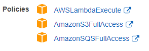
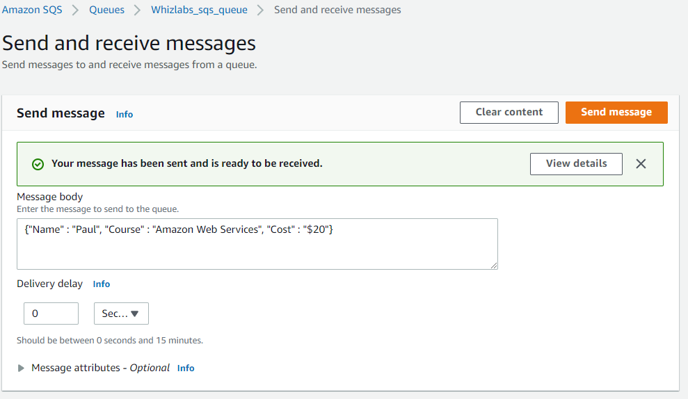
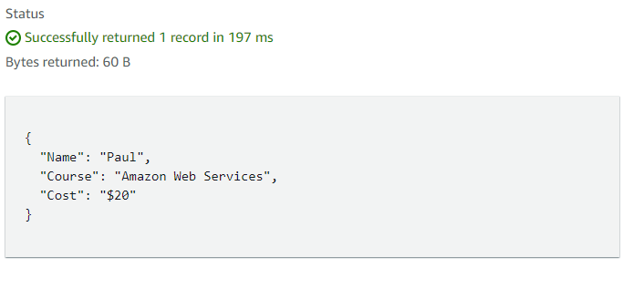

<br />

<p align="center">
  <a href="img/">
    
  </a>

  <h3 align="center">100 days in Cloud</h3>

<p align="center">
    Triggering Lambda function and processing SQS messages to S3
    <br />
    Lab 82
    <br />
  </p>


</p>

<details open="open">
  <summary><h2 style="display: inline-block">Lab Details</h2></summary>
  <ol>
    <li><a href="#services-covered">Services covered</a>
    <li><a href="#lab-description">Lab description</a></li>
    </li>
    <li><a href="#lab-date">Lab date</a></li>
    <li><a href="#prerequisites">Prerequisites</a></li>    
    <li><a href="#lab-steps">Lab steps</a></li>
    <li><a href="#lab-files">Lab files</a></li>
    <li><a href="#acknowledgements">Acknowledgements</a></li>
  </ol>
</details>

---

## Services Covered
*  **Lambda**

*  **S3**

*  **SQS**

---

## Lab description
The purpose of this lab is to create a chain of events. Messages send to a SQS Queue will trigger a Lambda function that will process them and store the output as JSON object to a S3 bucket.


* **Create Lambda function**
* **Create a SQS Queue**
* **Trigger Lambda function on new messages in the Queue**

---

### Lab date
10-10-2021

---

### Prerequisites
* AWS account

---

### Lab steps
1. Create a destination S3 bucket.

2. Create a IAM Role for Lambda, it should allow it execution, access to S3 and SQS

   

3. Create a Lambda function that will process and store messages

   ```python
   import json
   
   import boto3
   
   def lambda_handler(event, context):
   
       sqs_msg = json.loads(event['Records'][0]['body'])
   
       print("SQS Message : ", sqs_msg)
   
       
   
       bucket_name = "<<BUCKET_NAME>>"
   
       try:
   
           s3Client = boto3.client("s3", region_name= "us-east-1")
   
           Response = s3Client.put_object(Bucket= bucket_name, Key= "Message.json", Body= json.dumps(sqs_msg))
   
           print("S3 upload success !")
   
           return {
   
               "status" : 200,
   
               "body" : "S3 upload success"
   
           }
   
       except Exception as e:
   
           print("Client connection to S3 failed because ", e)
   
           return{
   
               "status" : 500,
   
               "body" : "S3 upload failed"
   
           }
   ```

4. Create a standard Queue in SQS.

5. In the Lambda **Configuration** tab go to **Triggers** and choose the created queue.

6. In SQS send a message to the queue.

 It should trigger execution of Lambda function and store that message to S3.

   


---
### Lab files

* lambda.py

---

### Acknowledgements

* [Whizlabs](https://play.whizlabs.com/site/task_details?lab_type=1&task_id=54&quest_id=36)

