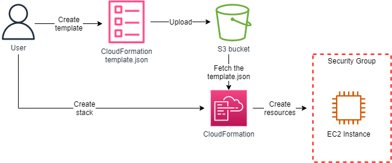
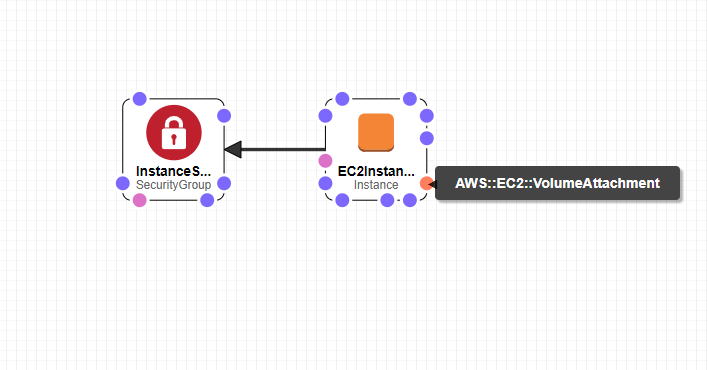
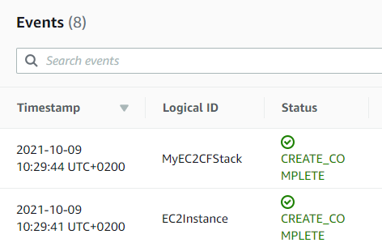
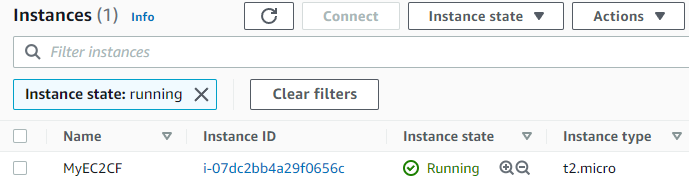

 

  

  <h3 align="center">100 days in Cloud</h3>

    Provisioning EC2 Instances using CloudFormation
     
    Lab 83
     
  

  
<h2 style="display: inline-block">Lab Details</h2>

  <ol>
    <li><a href="#services-covered">Services covered</a>
    <li><a href="#lab-description">Lab description</a></li>
    </li>
    <li><a href="#lab-date">Lab date</a></li>
    <li><a href="#prerequisites">Prerequisites</a></li>    
    <li><a href="#lab-steps">Lab steps</a></li>
    <li><a href="#lab-files">Lab files</a></li>
    <li><a href="#acknowledgements">Acknowledgements</a></li>
  </ol>

---

## Services Covered
*  **CloudFormation**

*  **S3**

*  **EC2**

---

## Lab description
*AWS CloudFormation Sample Template EC2InstanceWithSecurityGroupSample: Create an Amazon EC2 instance running the Amazon Linux AMI. The AMI is chosen based on the region in which the stack is run. This example creates an EC2 security group for the instance to give you SSH access. **WARNING** This template creates an Amazon EC2 instance. You will be billed for the AWS resources used if you create a stack from this template.*

* **Create a CloudFormation template**
* **Upload template to S3 bucket**
* **Create CloudFormation stack**

---

### Lab date
09-10-2021

---

### Prerequisites
* AWS account

---

### Lab steps
1. Write or copy CloudFormation [template file](template.json) and upload it to a S3 bucket.

2. Create a CloudFormation Stack. Use the template.json stored in S3 as a source file. You can review it in Designer.

   

   When the stack gets created

   

   Go to EC2 and review created resources

   

3. Delete the stack which will delete the created resources.

---
### Lab files

* template.json

---

### Acknowledgements

* [Whizlabs](https://play.whizlabs.com/site/task_details?lab_type=1&task_id=36&quest_id=36)

