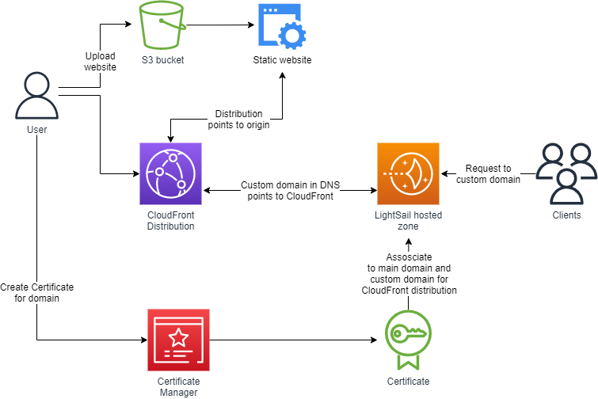
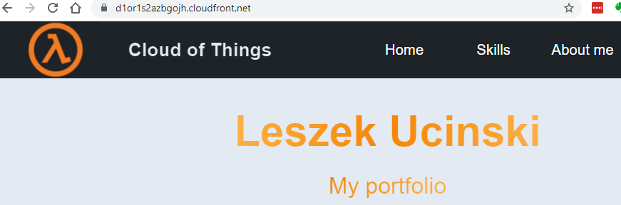
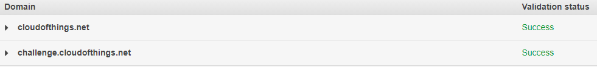
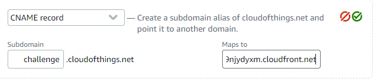
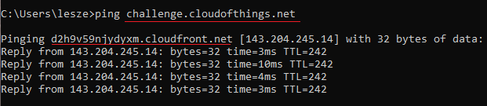

 

  

  <h3 align="center">100 days in Cloud</h3>

    Distribute a S3 hosted static website with CloudFront
     
    Lab 84
     
  

  
<h2 style="display: inline-block">Lab Details</h2>

  <ol>
    <li><a href="#services-covered">Services covered</a>
    <li><a href="#lab-description">Lab description</a></li>
    </li>
    <li><a href="#lab-date">Lab date</a></li>
    <li><a href="#prerequisites">Prerequisites</a></li>    
    <li><a href="#lab-steps">Lab steps</a></li>
    <li><a href="#lab-files">Lab files</a></li>
    <li><a href="#acknowledgements">Acknowledgements</a></li>
  </ol>

---

## Services Covered
*  **CloudFront**

*  **Certificate Manager**

*  **LightSail**

---

## Lab description
In this lab a static website hosted in S3 bucket will be distributed globally and securely with CloudFront. Then a custom domain will be pointing to that distribution. To do that the domain must have a Certificate associated to it because the CloudFront distribution will distribute the HTTPS version of that site.

* **Create a static HTML + CSS + JS website**
* **Create a Certificate for a domain**
* **Create CloudFront distribution**
* **Point a custom domain to the CF distribution**
* **Changing CNAME records in DNS management**

---

### Lab date
08-10-2021

---

### Prerequisites
* AWS account
* HTML website
* Registered domain (Route 53)
* LightSail (DNS management)

---

### Lab steps
1. Create a bucket and upload index.html and your other files like styles.css or app.js. There are two ways to proceed with this task. Either by granting the bucket public access and changing the buckets policy or by creating necessary setup in CloudFront in the next step I'll continue with the second approach.

2. Go to CloudFront and create a distribution. Choose your bucket, and under **S3 bucket access** choose *Yes use OAI* and create a OAI (Origin access identity) that will allow CloudFront to access the bucket. Then check in the option to update the bucket policy. Then fill in the *Default root object* with the *index.html* and create distribution. Now the website is distributed globally with CloudFront under a provided domain:

   

3. I want this website to be a part of my LightSail server and to have a more human-friendly domain so I created a **A record** in my LightSail hosted zone for that page. 

4. In order to use that custom domain for my CloudFront distribution I needed to create a Certificate issued in **Certificate Manager**, validate that I can configure those domains in DNS configuration by adding CNAM records provided by CM:

   

5. Now I could use the CloudFront domain as a destination for **CNAME** record in DNS records:

   

6. Now visiting https://challenge.cloudofthings.net responds with the CloudFront cached website:

   

   And how fast it is! 

---
### Lab files

* 

---

### Acknowledgements

* 

