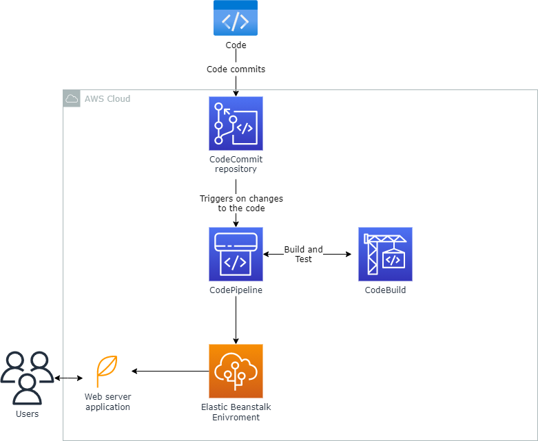
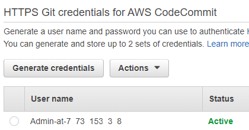
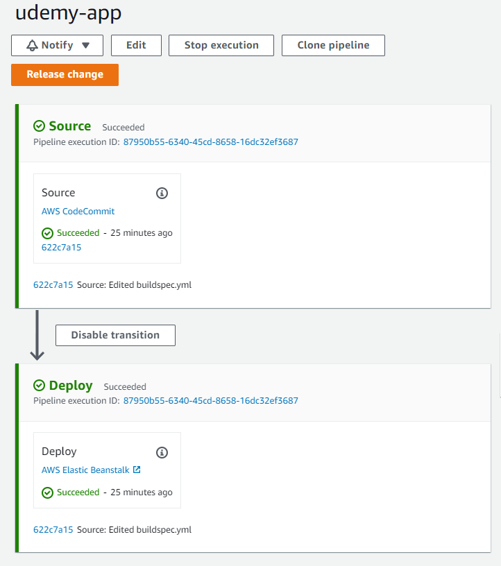
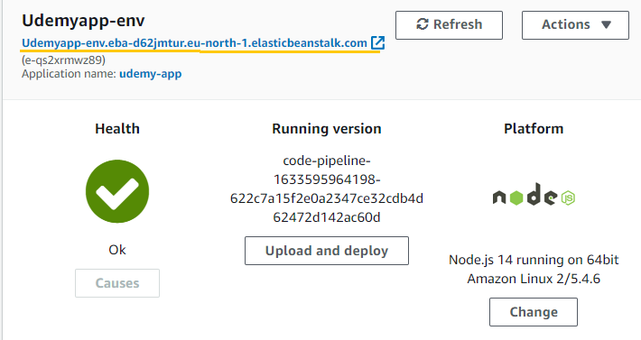
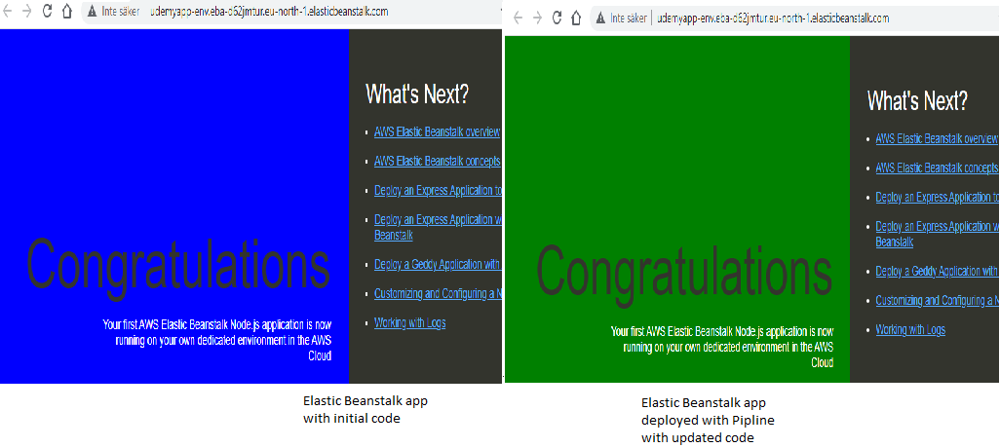
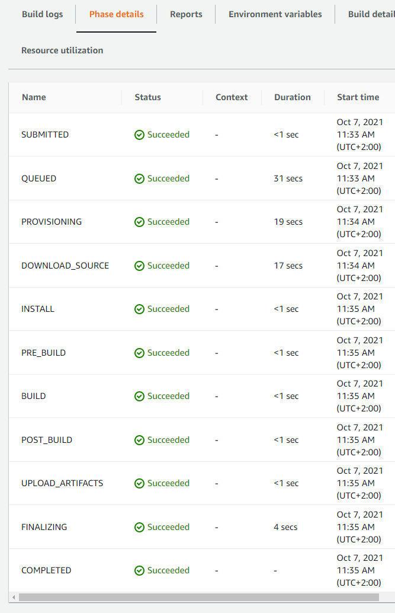
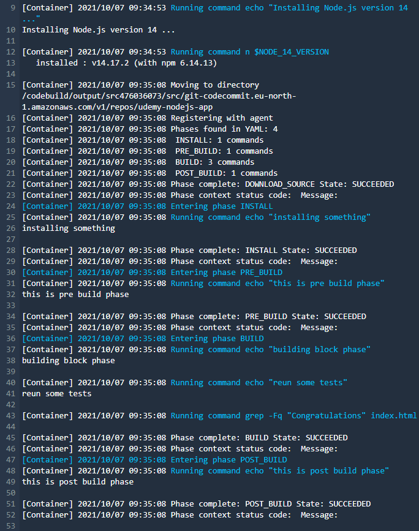
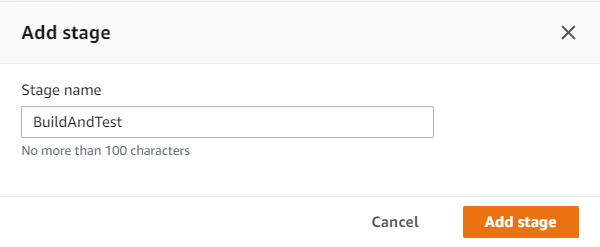
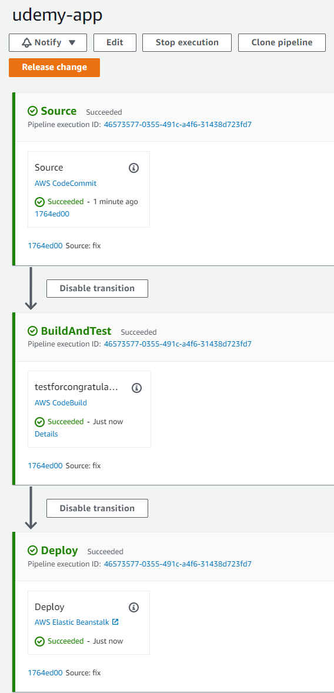

<br />

<p align="center">
  <a href="img/">
    
  </a>

  <h3 align="center">100 days in Cloud</h3>

<p align="center">
    CICD - Continuous Integration Continuous Delivery
</p>  
<p align="center">
    Deploying an node.js app on Elastic Beanstalk with CodeCommit, CodePipeline, CodeBuild
    <br />
    Lab 85
    <br />
  </p>


</p>

<details open="open">
  <summary><h2 style="display: inline-block">Lab Details</h2></summary>
  <ol>
    <li><a href="#services-covered">Services covered</a>
    <li><a href="#lab-description">Lab description</a></li>
    </li>
    <li><a href="#lab-date">Lab date</a></li>
    <li><a href="#prerequisites">Prerequisites</a></li>    
    <li><a href="#lab-steps">Lab steps</a></li>
    <li><a href="#lab-files">Lab files</a></li>
    <li><a href="#acknowledgements">Acknowledgements</a></li>
  </ol>
</details>

---

## Services Covered
*   **Elastic Beanstalk**

* **CodeCommit**

* **CodeBuild**
* **CodePipeline**

---

## Lab description
This is a starting point for the learning path of CICD practices. In this lab I will deploy a node.js app in Elastic Beanstalk environment through CodeCommit, CodePipline and CodeBuild tools.


* **Create and deploy Elastic Beanstalk web server app**
* **Create and configure CodeCommit repository**
* **Create a pipeline in CodePipeline**
* **Create project in CodeBuild**
* **Re-deploy Elastic Beanstalk app automatically with CodePipeline**
* **Write buildspec.yml for CodeBuild**

---

### Lab date
07-10-2021

---

### Prerequisites
* AWS account

---

### Lab steps
1. To start with, create a code repository in **CodeCommit**. You want to be able to commit your code using git, for that your user needs **HTTPS Git credentials for AWS CodeCommit** set up in **IAM Management Console**. While in there, choose your user and generate credentials:

   

   Save them and have them at hand, you'll need them to log in soon. Open git bash locally in your working folder and initiate git

   ```bash
   git init
   ```

   then copy the clone command from your CodeCommit repository. It'll be empty at the moment by it allow you to log in and set up the remote repository  for you local git.

2. Create an **Elastic Beanstalk** environment. Choose **Web server environment** because it'll be hosting a node.js app. Give it a name, you might use some domain name, choose node.js as platform and for now choose sample application, we'll be replacing it with our code using CodePipline. When created continue to the next step.

3. My application is just a simple website with [index.html](./index.html), [package.json](./package.json) and [app.js](./app.js). Push those files to the CodeCommit repository. 

4. Create a Pipline in **CodePipeline**. Attach a new role that will allow pipeline to create and modify resources, use the default if you don't have your own. As **Source provider** choose AWS CodeCommit, and the repository created earlier. Skip the **Build provider** section for now. And as **Deploy provider** choose Elastic Beanstalk and the application created earlier. When you start it it should get the source code from CodeCommit and use it to deploy Elastic Beanstalk application.

   

   You can go back to Elastic Beanstalk and go to application url to check if it's been updated.

   

5. Now test if the pipeline works. Change some parameters in index.html, for example background color and push the updated file to the repository. It'll automatically will trigger a deployment of changed code and when done, refresh EB app site and see the results:

   

   Maybe that's not much but it shows how easy it is to start CICD development with CodePipline.
   
6. Next step is to create a build project with **CodeBuild**. The source code will still be the same **CodeCommit repository**, Environment will be a **Managed image** of type Ubuntu, and **Buildspec** will be a file located in the repository's root folder. Before starting that build continue to step 7.

7. In your local code source folder create a yaml file called **buildspec.yml**:

   ```yaml
   version: 0.2
   
   phases:
       install:
           runtime-versions:
             nodejs: latest
           commands:
             - echo "installing something"
       pre_build:
           commands:
             - echo "this is pre build phase"
       build:
           commands:
             - echo "building block phase"
             - echo "reun some tests"
             - grep -Fq "Congratulations" index.html
       post_build:
           commands:
             - echo "this is post build phase"
   ```

   This simple code does a check on the index.html file and looks for the word *Congratulations*  if the check passes then it'll continue with the build. Commit the new file and push it to the repository.

8. **Start build** of the build project in CodeBuild. And since the word *Congratulations* is indeed in the source file the build succeeded:

   

   

   And we can see the build logs:

   

9. Now add a new stage in the pipeline by edtiting it:

   

   Add action group and choose **CodeBuild** as action provider, input artifacts set as *SourceArtifact*. Now if changes are made that remove word *Congratulations* the build will fail. 

   

   


---
### Lab files

* index.html - simple website
* app.js - javascript for website
* package.json - dependencies for Elastic Beanstalk app
* buildspec.yml - build specification for CodeBuild

---

### Acknowledgements

* [Udemy](https://www.udemy.com/course/aws-certified-developer-associate-dva-c01/learn/lecture/19729994#overview)

