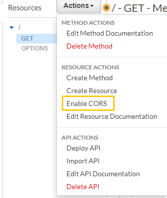
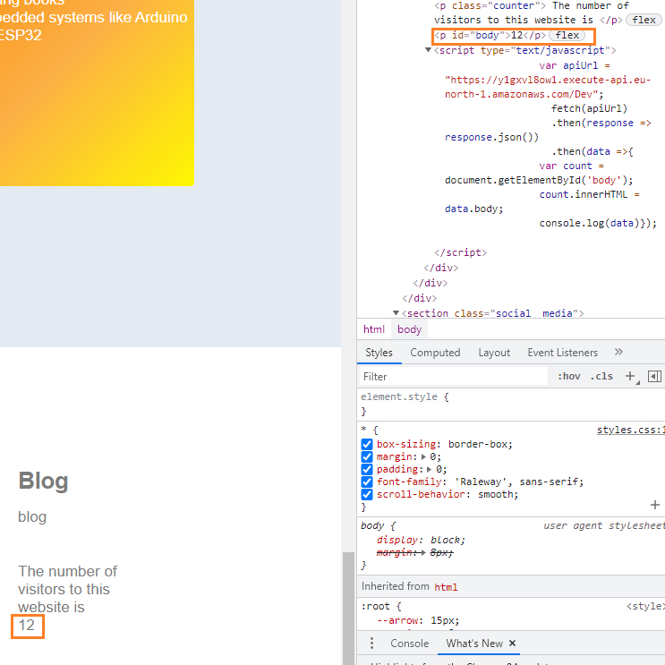
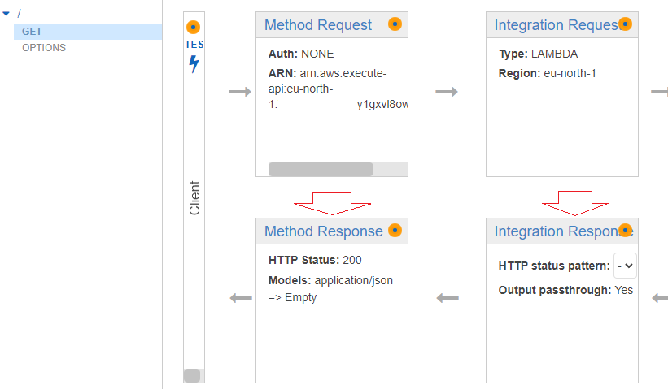
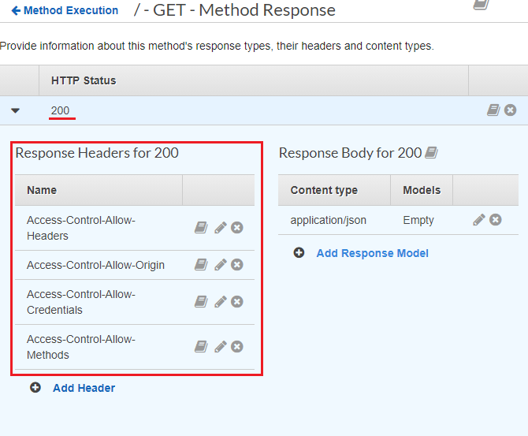
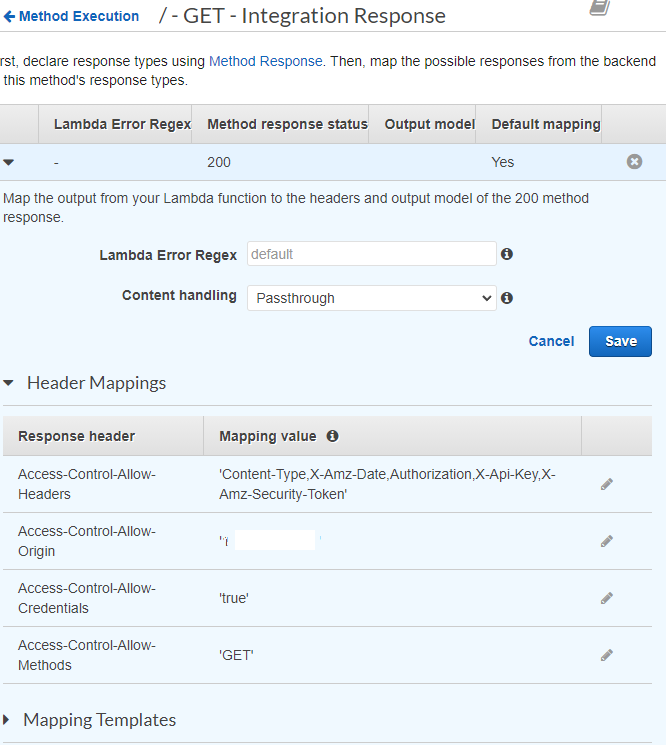

<br />

<p align="center">
  <a href="img/">
    
  </a>

  <h3 align="center">100 days in Cloud</h3>

  <p align="center">
    Website visitors counter backed with API Gateway, Lambda and DynamoDB - Part Two
    <br />
    Lab 86
    <br />
  </p>

</p>

<details open="open">
  <summary><h2 style="display: inline-block">Lab Details</h2></summary>
  <ol>
    <li><a href="#services-covered">Services covered</a>
    <li><a href="#lab-description">Lab description</a></li>
    </li>
    <li><a href="#lab-date">Lab date</a></li>
    <li><a href="#prerequisites">Prerequisites</a></li>    
    <li><a href="#lab-steps">Lab steps</a></li>
    <li><a href="#lab-files">Lab files</a></li>
    <li><a href="#acknowledgements">Acknowledgements</a></li>
  </ol>
</details>

---

## Services Covered
*  **DynamoDB**
*   **Lambda**
*   **API Gateway**

---

## Lab description
I'll continue on my previous [lab](https://github.com/CloudedThings/100-Days-in-Cloud/tree/main/Labs/87-Create-API-based-visitors-counter) here. I already set-up a DynamoDB table, Lambda function and API Gateway, now it's time to write a little bit of JavaScript code for my website that'll make calls to API and return the _visits_ value from DynamoDB. 


* **Enable CORS in API Gateway**
* **Write JavaScript for website**
* **Create a Lambda Function**
* **Create API Gateway**
* **Create DynamoDB Table**
* **Integrate API with Lambda function**

---

### Lab date
06-10-2021

---

### Prerequisites
* AWS account
* Postman

---

### Lab steps
1. Deploy your API, so it's ready for testing. Next in in **Actions** drop down menu go to Enable CORS

   

   Allow the GET and OPTIONS methods and leave rest of the values as default. This will activate CORS in you API.

2. Next you want to add a script in you HTML file that will make a call to API and display fetched value

   ```javascript
   <p class="counter"> The number of visitors to this website is </p>
      <p id ="body"></p>
          <script type = "text/javascript">
            var apiUrl = "https://y1gxvl8ow1.execute-api.eu-north-1.amazonaws.com/Dev";
                fetch(apiUrl)
                   .then(response => response.json())
                   .then(data =>{
             			var count = document.getElementById('body');
                   	count.innerHTML = data.body;
                   	console.log(data)});
             </script>
   ```

   First line gives it some line to indicate what the number suppose to show. Then comes the field for the value with id *body*. The script fetches the value from and then returns the value to the html code on your website. On my website (still in developement stage) and in inspector it looks like taht, and obviously the number updates every name some hits the site or refreshes:

   

   

3. Additional configuration in CORS would be to limit down the accessibility of the API. Only your application should be able to make calls to the API. In your API Gateway, choose your GET method and then in both Method Response and Integration Response continute to HTTP Status 200:

   

   The configuration should look like that:

   

   And then in Integration Response add your websites ip address (the white field on my screen):

   

   

   


---
### Lab files

* 

---

### Acknowledgements

