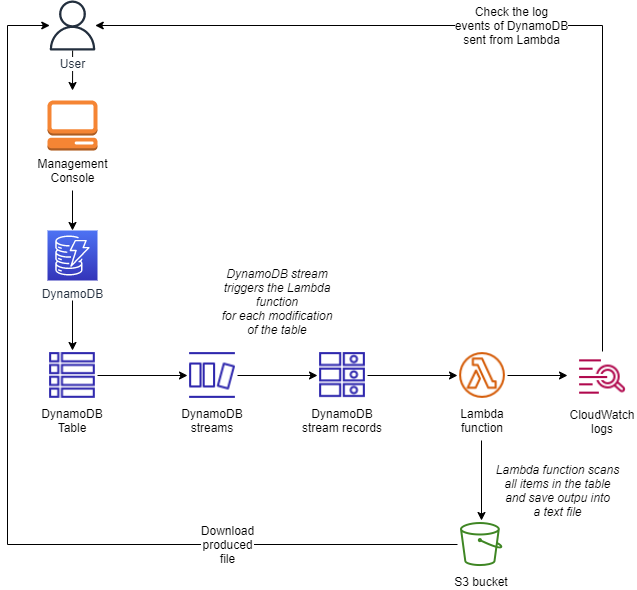
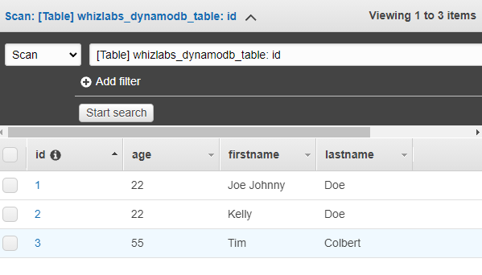
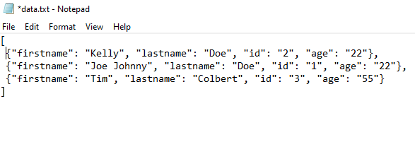

<br />

<p align="center">
  <a href="img/">
    
  </a>


  <h3 align="center">100 days in Cloud</h3>

  <p align="center">
    DynamoDB Streams triggers Lambda function and save file to S3 bucket
    <br />
    Lab 88
    <br />
  </p>


</p>

<details open="open">
  <summary><h2 style="display: inline-block">Lab Details</h2></summary>
  <ol>
    <li><a href="#services-covered">Services covered</a>
    <li><a href="#lab-description">Lab description</a></li>
    </li>
    <li><a href="#lab-date">Lab date</a></li>
    <li><a href="#prerequisites">Prerequisites</a></li>    
    <li><a href="#lab-steps">Lab steps</a></li>
    <li><a href="#lab-files">Lab files</a></li>
    <li><a href="#acknowledgements">Acknowledgements</a></li>
  </ol>
</details>

---

## Services Covered
*  **DynamoDB**
*   **Lambda**

---

## Lab description

In this lab a DynamoDB table will be created and some item put in. Then S3 bucket will be created as destination for files generated by a Lambda function. That function will scan the table, and for every item in the table it'll read it and then eventually save it to a text file into the bucket. Lambda will be triggered whenever a new item or a change to an item occurs.


* **Create a Lambda Function**
* **Create S3 bucket**
* **Create DynamoDB Table**
* **Create Trigger for table**

---

### Lab date
04-10-2021

---

### Prerequisites
* AWS account

---

### Lab steps
1. Create DynamoDB Table. Create a Partition key called _id_ of type string. Add couple of items to the table, with aditional attributes.

2. Create a S3 Bucket for the incoming files. Note buckets name.

3. Create a Lambda Function with Python as runtime. [Code]() will scan the table and save all items as a text file to the S3 bucket. Fill the buckets and table names with your values.

   ```python
   import boto3
   import json
   from botocore.exceptions import ClientError
   def lambda_handler(event, context):
       data = []
       TableName = "whizlabs_dynamodb_table"
       try:
           s3 = boto3.resource('s3', region_name='us-east-1')
           ddbclient = boto3.client('dynamodb', region_name='us-east-1')
           response = ddbclient.list_tables()
           mytables = response['TableNames']
           
           if TableName in mytables:
               allitems = ddbclient.scan(TableName= TableName)
               for item in allitems['Items']:
                   item_list = {}
                   allKeys = item.keys()
                   for k in allKeys:
                       value = list(item[k].values())[0]
                       item_list[k] = str(value)
                   data.append(item_list)
               data = json.dumps(data)
               responses3 = s3.Object('whizlabs.38916.94360902', 'data.txt').put(Body=data)
               print("Completed Upload to S3")
           print("Lambda run completed")
           return {
                   'statusCode': 200,
                   'body': json.dumps("success")
                   }
       except ClientError as e:
               print("Detailed error: ",e)
               return {
                       'statusCode': 500,
                       'body': json.dumps("error")
                       }
       except Exception as e:
               print("Detailed error: ",e)
               return {
                       'statusCode': 500,
                       'body': json.dumps("error")
                       }
   ```

   

4. Add Trigger to the DynamoDB Table. Choose your table, under Trigger section choose **Create trigger** and from drop-down menu **Choose Existing Lambda Function**. Use the function created earlier, BatchSize set to 1 and **EnableTrigger** checked in. 

   

5. Add new Items to the table to trigger the Lambda Function. This should produce a _data.txt_ file to the S3 bucket. 

   
---
### Lab files

* [lambda.py]()

---

### Acknowledgements
* [whizlabs](https://play.whizlabs.com/site/task_details?lab_type=1&task_id=63&quest_id=31)

