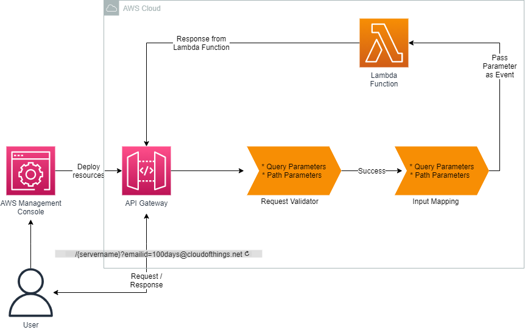
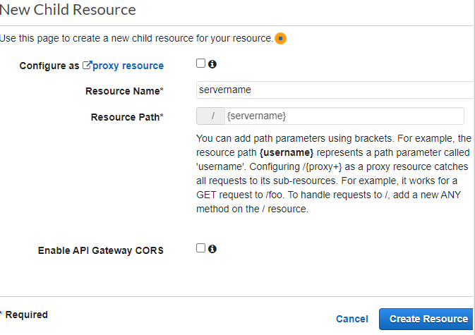
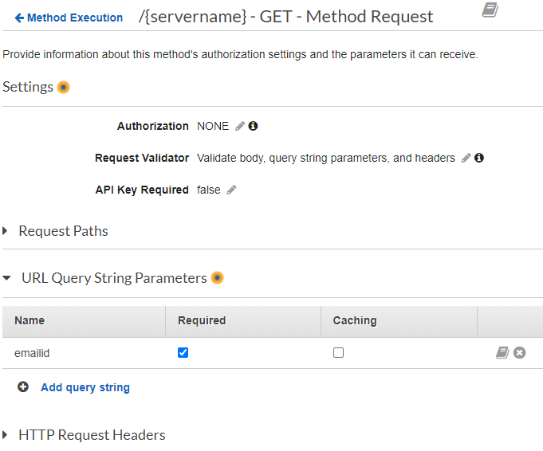
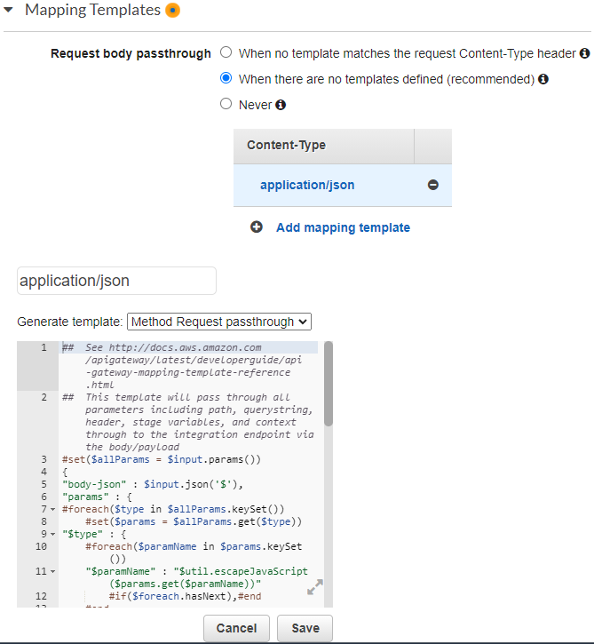

<br />

<p align="center">
  <a href="img/">
    
  </a>


  <h3 align="center">100 days in Cloud</h3>

  <p align="center">
    Building a REST API Gateway with apth and query string parameters
    <br />
    Lab 89
    <br />
  </p>


</p>

<details open="open">
  <summary><h2 style="display: inline-block">Lab Details</h2></summary>
  <ol>
    <li><a href="#services-covered">Services covered</a>
    <li><a href="#lab-description">Lab description</a></li>
    </li>
    <li><a href="#lab-date">Lab date</a></li>
    <li><a href="#prerequisites">Prerequisites</a></li>    
    <li><a href="#lab-steps">Lab steps</a></li>
    <li><a href="#lab-files">Lab files</a></li>
    <li><a href="#acknowledgements">Acknowledgements</a></li>
  </ol>
</details>

---

## Services Covered
*   **Amazon API Gateway**
*   **Lambda**

---

## Lab description
This lab practises on creating an API Gateway with path and query string parameters that will be integrated with Lambda function

* **Create a Lambda Function**
* **Create API Gateway**
* **Create resources for API**
* **Send API calls and use parameter strings**

---

### Lab date
03-10-2021

---

### Prerequisites
* AWS account

---

### Lab steps
1. Create a Lambda Function. Choose Python as runtime language, create a new execution role using the policy template: **Basic Lambda@Edge permissions**. The function code:

   ```python
   import json
   
    
   def lambda_handler(event, context):
   
       #Path parameter passed to Lambda function
   
       servername = event["params"]["path"]["servername"]
   
       
   
       #Query string parameter passed to Lambda function
   
       Email_id = event['params']['querystring']['emailid']
   
       
   
       return {
   
           "Path Parameter" : servername,
   
           "Query string Parameter" : Email_id
   
       }
   ```

2. Create a REST API Gateway. Then under **Actions** choose **Create Resource**, give it a name and type that name as **Resource Path** then click on **Create Resource**

   

3. Next create a Method in **Actions** and in drop down menu choose **GET**. As **Integration type** choose Lambda Function and then type the earlier created functions name. After that you'll be presented with the API structure.

4. On the same screen choose **Method Request** and in the settings change the **Request Validator** field to _Validate body, query string parameters and headers_. Then under **URL Query String Parameters** add query string, enter *emailid* and make it **Required**. 

   

   Go back to **Method Execution** by cklicking the link on the top.

5. Go to the **Integration Request** and under **Mapping templates** for the **Request body passthrough** choose *When there are no templates defined* and **Add mapping template** with value *application/json*. Then generate template *Method Request passthrough*:

   

6. Go back and deploy the API. Select the GET method resource and in **Actions** choose **Deploy API**. Give it a name and deploy. You'll see the **Invoke URL**. Then under **Stages** choose the name resource and GET method and copy the URL. Now if you replace name with *Production* and add *emailid* you will receive GET request's response from the API:

   

---
### Lab files

* [lambda.py]()

---

### Acknowledgements
* [whizlabs](https://play.whizlabs.com/site/task_details?lab_type=1&task_id=157&quest_id=36)

