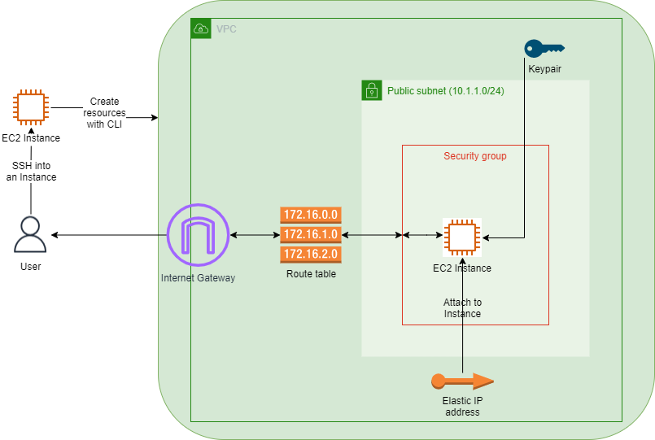
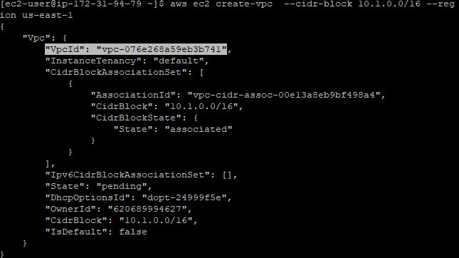
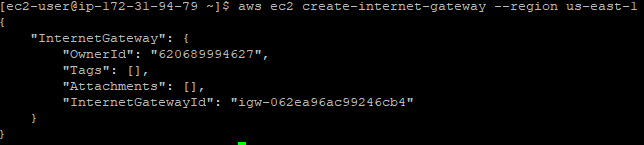
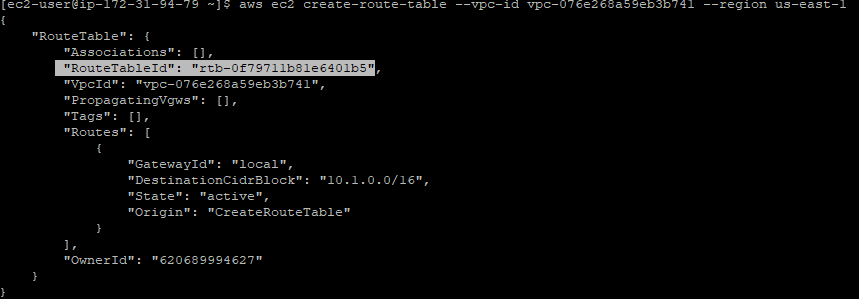
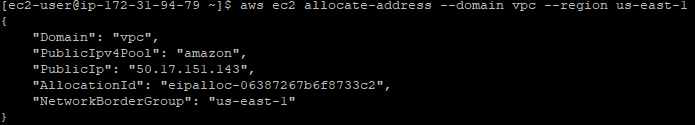

<br />

<p align="center">
  <a href="/img/">
    
  </a>


  <h3 align="center">100 days in Cloud</h3>

  <p align="center">
    Create a VPC and an EC2 Instance for website hosting using AWS CLI
    <br />
    Lab 91
    <br />
  </p>


</p>

<details open="open">
  <summary><h2 style="display: inline-block">Lab Details</h2></summary>
  <ol>
    <li><a href="#services-covered">Services covered</a>
    <li><a href="#lab-description">Lab description</a></li>
    </li>
    <li><a href="#lab-date">Lab date</a></li>
    <li><a href="#prerequisites">Prerequisites</a></li>    
    <li><a href="#lab-steps">Lab steps</a></li>
    <li><a href="#lab-files">Lab files</a></li>
    <li><a href="#acknowledgements">Acknowledgements</a></li>
  </ol>
</details>

---

## Services Covered
*  **Amazon EC2**
*  **Elastic IP address**
*  **AWS CLI**
* **Internet Gateway**

---

## Lab description
Lab practice's creating VPC, subnets, an Internet Gateway, a route table and configuring these services to work together. Then EC2 instance will be launched into the VPC and a page hosted on that instance using AWS CLI commands. Lab includes:

* **Usage of AWS CLI**
* **Creating EC2 Instances**
* **Creating VPCs, Internet Gateway, Route Table**
* **Allocating and assigning Elastic IP address to the EC2 Instance**
* **Creating subnets and Security Group Rules**

---

### Lab date
01-10-2021

---

### Prerequisites
* AWS account
* [putty](https://www.putty.org/) for SSH connection

---

### Lab steps
1. In IAM create role for EC2 instance attach the _AmazonEC2FullAccess_ permission to it.
2. In EC2 launch an Amazon Linux 2 instance of type t2.micro. Then attach the created IAM role to it. Configure and assign a new security group that will allow SSH connections into the instance. Create and download new key pair.
3. Connect to the instance using SSH and provided key pair. 
4. Create a VPC using AWS CLI. Run this command and change region accordingly:
```
aws ec2 create-vpc  --cidr-block 10.1.0.0/16 --region us-east-1
```
​	Copy and save the VPC ID



5. Create a Subnet within the VPC

   ```bash
   aws ec2 create-subnet --vpc-id vpc-076e268a59eb3b741 --cidr-block 10.1.1.0/24 --region us-east-1
   ```

   Replace the VPC with yours. Note the SubnetID

6.  Create an Internet Gateway

   ```bash
   aws ec2 create-internet-gateway --region us-east-1
   ```

   

7.  Attach Internet Gateway to VPC. Replace VPC and IG ids with yours

   ```bash
   aws ec2 attach-internet-gateway --vpc-id vpc-076e268a59eb3b741 --internet-gateway-id igw-062ea96ac99246cb4 --region us-east-1
   ```

8. Create a Route table for VPC. Note the RouteTableID

   ```
   aws ec2 create-route-table --vpc-id vpc-076e268a59eb3b741 --region us-east-1
   ```

   

9.  Create a public route in the Route table pointing to the Internet Gateway. Replace Route Table and Gateway ids with yours.

   ```bash
   aws ec2 create-route --route-table-id rtb-0f79711b81e6401b5 --destination-cidr-block 0.0.0.0/0 --gateway-id igw-062ea96ac99246cb4 --region us-east-1
   ```

10. Associate the Subnet with your Route table

    ```bash
    aws ec2 associate-route-table  --subnet-id subnet-0729e993842e07ad7 --route-table-id rtb-0f79711b81e6401b5 --region us-east-1
    ```

11. Create a Security Group

    ```
    aws ec2 create-security-group --group-name my-sg --description "My security group" --region us-east-1 --vpc-id vpc-076e268a59eb3b741
    ```

    Note the security group ID.

12. Add Rules allowing traffic for HTTP on port 80 and SSH on port 22

    ```bash
    aws ec2 authorize-security-group-ingress --group-id sg-0770cff403a4005c7 --protocol tcp --port 80 --cidr 0.0.0.0/0 --region us-east-1
    ```

    ```bash
    aws ec2 authorize-security-group-ingress --group-id sg-0770cff403a4005c7 --protocol tcp --port 22 --cidr 0.0.0.0/0 --region us-east-1
    ```

13. Create a KeyPair

    ```bash
    aws ec2 create-key-pair --key-name MyCLIKeyPair --query 'KeyMaterial' --region us-east-1
    ```

14. Create user data file. 

    ```bash
    nano data.txt
    ```

    With following contents that will install a php server called httpd with an index html site and start the service:

    ```bash
    #!/bin/bash
    sudo su
    yum update -y
    yum install httpd -y
    echo "<html><h1>Welcome to Whizlabs Server</h1><html>" >> /var/www/html/index.html
    systemctl start httpd
    systemctl enable httpd
    ```

    Save the file.

15. Create another t2.micro EC2 Instance with Amazon Linux 2 with the user data:

    ```bash
    aws ec2 run-instances --image-id  ami-062f7200baf2fa504 --count 1 --instance-type t2.micro --key-name MyCLIKeyPair --region us-east-1  --security-group-id sg-0770cff403a4005c7 --user-data file://./data.txt --subnet-id subnet-0729e993842e07ad7
    ```

    

    Note the new EC2 ID.

16. Allocate an Elastic Ip address and note the AllocationID from the output

    ```bash
    aws ec2 allocate-address --domain vpc --region us-east-1
    ```

    

17. Associate the Elastic IP Address with the EC2 Instance (with your IDs)

    ```bash
    aws ec2 associate-address --instance-id i-0b1f210708cc97bbf --allocation-id eipalloc-06387267b6f8733c2 --region us-east-1
    ```

    Go to the PublicIp address and check if everything works.

18. Don't forget to stop the instances:

    ```bash
    aws ec2 stop-instances --instance-ids i-056dba02b547cb207 --region us-east-1
    ```

    Disassociate Elastic IP address:

    ```bash
    aws ec2 disassociate-address --association-id eipassoc-0bcac2ed3d4837f86 --region us-east-1
    ```

    Release an Elastic IP address:

    ```bash
    aws ec2 release-address --allocation-id eipalloc-06387267b6f8733c2 --region us-east-1
    ```

    Delete subnet, Internet Gateway and Route Table:

    ````bash
    aws ec2 delete-internet-gateway --internet-gateway-id igw-062ea96ac99246cb4 --region us-east-1
    ````

    ```bash
    aws ec2 delete-route-table --route-table-id rtb-0f79711b81e6401b5 --region us-east-1
    ```

    ```bash
    aws ec2 delete-subnet --subnet-id subnet-0729e993842e07ad7 --region us-east-1
    ```

    ```bash
    aws ec2 delete-security-group --group-id sg-0770cff403a4005c7 --region us-east-1
    ```

    This way clean-up process would be complete.

### Lab files

* None

---

### Acknowledgements
* [whizlabs](https://play.whizlabs.com/site/task_details?lab_type=1&task_id=140&quest_id=36)

