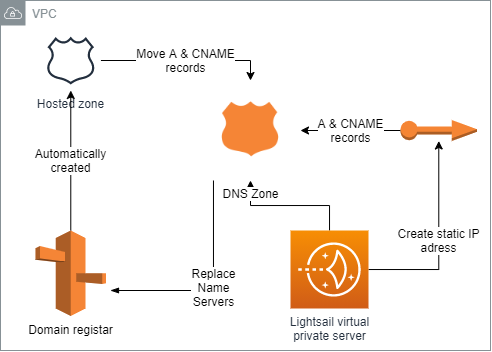
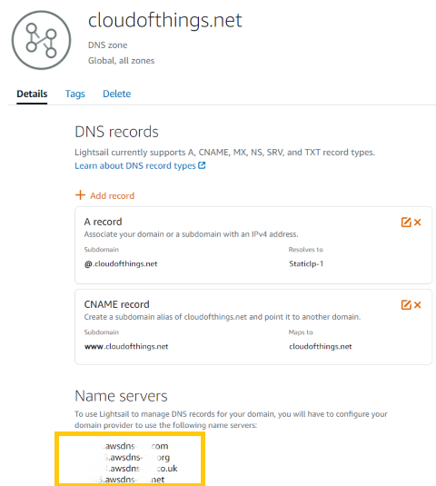
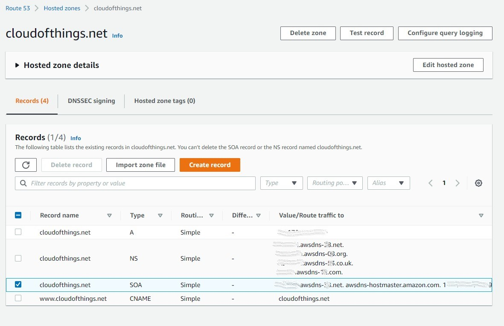

 

  

  <h3 align="center">100 days in Cloud</h3>

  

    Moving Route 53 DNS Hosted Zone to LightSail
     
    Lab 92
     
  

  
<h2 style="display: inline-block">Lab Details</h2>

  <ol>
    <li><a href="#services-covered">Services covered</a>
    <li><a href="#lab-description">Lab description</a></li>
    </li>
    <li><a href="#lab-date">Lab date</a></li>
    <li><a href="#prerequisites">Prerequisites</a></li>    
    <li><a href="#lab-steps">Lab steps</a></li>
    <li><a href="#lab-files">Lab files</a></li>
    <li><a href="#acknowledgements">Acknowledgements</a></li>
  </ol>

---

## Services Covered
*  **Lightsail**
*  **Route 53**
*  **DNS hosted zones**

---

## Lab description
Domains registered in Route 53 will have an automatically activated Hosted Zone, but the Lightsail service comes with free DNS management. This lab is assuming that a domain was registered with Route 53, has a Hosted Zone and that Lightsail is already created too. Then the Routes 53 will be deleted and DNS records moved to Lightsail DNS Management.

​	**Route 53 Hosted Zone:**

​			:credit_card: costs 0.50$ per hosted zone a month (up to 25 hosted zones)

​	**LightSail DNS Zone:**

​			:credit_card: 3 DNS zones are free and you can create unlimited records for each DNS zone

​			:star: 3 million DNS queries per month are included in the monthly fee (which is 3.5$/mo today)

* **Registering a domain in Route 53**
* **Create LightSail instance**
* **Create DNS hosting zone in Lightsail**
* **Change Name servers for registered domain**
* **Create records in Lightsail hosting zone**

---

### Lab date
30-09-2021

---

### Prerequisites
* AWS account
* Domain registered in Route 53
* An active Lightsail instance

---

### Lab steps
1. Some pre-lab steps include: [Register](https://docs.aws.amazon.com/Route53/latest/DeveloperGuide/domain-register.html) a domain in Route 53. Go to Route 53 -> Registered domains -> Register Domain. This obviously will come at a cost depending on which Top Level Domain you choose. Then create a Lightsail virtual private server (interchangeably I call them Instance, but they're not an EC2 Instance, you don't have to manage any hardware or worry about maintenance). Create a static IP. 

2. In the Amazon Lightsail dashboard go to **Networking** and click on  enter the domain name you have registered and create the DNS zone.  

3. Add a record of type **A record** leave subdomain field empty and paste your staticIP address in. Add another record of type **CNAME record** and as a subdomain type in **www** and make it point to your domain name. While here take note of the Name servers you'll need them later.

   

4.  When done go to Route 53 then to Hosted Zones. If you haven't registered any records it will contain only NS (Name Server records) and SOA (start of authority). If you have registered your domain in the hosted zone as I did it'll look something like this:

   

   Start with deleting both A and CNAME records and delete the hosted zone.

5. Go to **Registered domains** open your domain and in the **Name servers** section choose *Add or edit name servers* here you need to paste the server values from your hosted zone in Lightsail. This will allow the Lightsail DNS management of your domain instead of Route 53. More on this in [documentation](https://docs.aws.amazon.com/Route53/latest/DeveloperGuide/domain-name-servers-glue-records.html#domain-name-servers-glue-records-adding-changing). :exclamation: Updating the domain registration might take several hours.
---

### Lab files
* None

---

### Acknowledgements
* [AWS](https://docs.aws.amazon.com/Route53/latest/DeveloperGuide/domain-name-servers-glue-records.html#domain-name-servers-glue-records-adding-changing)

