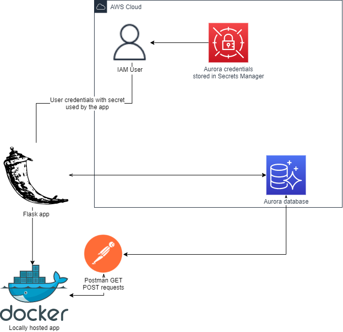

<br />
<p align="center">
  <a href="https://github.com/CloudedThings/100-Days-in-Cloud">
    
  </a>

  <h3 align="center">100 days in Cloud</h3>

  <p align="center">
    Building a Docker based Flask App with Aurora Serverless
    <br />
    Lab 93
    <br />
  </p>
</p>

<details open="open">
  <summary><h2 style="display: inline-block">Lab Details</h2></summary>
  <ol>
    <li><a href="#services-covered">Services covered</a>
    <li><a href="#lab-description">Lab description</a></li>
    </li>
    <li><a href="#lab-date">Lab date</a></li>
    <li><a href="#prerequisites">Prerequisites</a></li>    
    <li><a href="#lab-steps">Lab steps</a></li>
    <li><a href="#lab-files">Lab files</a></li>
    <li><a href="#acknowledgements">Acknowledgements</a></li>
  </ol>
</details>

---

## Services Covered
* **RDS**
* **Secrets Manager**
* **IAM**

---

## Lab description
**This lab comes with additional cost, Amazon Aurora service isn't included in Free Tier**
Purpose of this lab is to create an Amazon Aurora database that would serve the Flask Python app run locally as a Docker container. A new user will be created and stored in the Secrets Manager for secure connection. The Aurora database will handle the request through API calls sent from POSTMAN for testing purposes.
* **Create an Amazon Aurora database**
* **Enable API calls to Aurora**
* **Create Users with necessary permissions**
* **Creating secrets in Secrets Manager**
* **Connecting to Aurora by using SM secret**
* **Running Flask app in Docker container**

---

### Lab date
29-09-2021

---

### Prerequisites
* AWS account
* some knowledge about Python syntax
* Docker installed
* Postman for API calls testing

---

### Lab source
[Be A Better Dev](https://www.youtube.com/watch?v=NM4Vd7fpZWk&t=0s)

---

### Lab steps
1. In the AWS Management Console go to RDS and create a database. Choose Amazon Aurora as an engine type PostgreSQL edition. For the **Capacity type** choose **Serverless**, if you don't see that option you might want to change to another region that offers the option because it's cheaper and we don't need lots of resources for the lab purposes anyway. Under the **Capacity settings** set the minimum and maximum Aurora capacity units to 2 and enable **Pause after inactivity** to 2-5 minutes, this will scale down the Aurora Serverless cluster to 0 ACUs and save you money. Under **Connectivity** go to **Additional configuration** and enable Web Service API that will allow REST endpoints. Under **Additional configuration** put in the database name and store it locally in your code. Uncheck **Deletion protection** this will make clean-up easier. Create the database, this will take a couple of minutes.
2. Go to the Secrets Manager. Create a secret of type **Credentials for RDS database**, type in the username and password you used in the Aurora creation process. Select the created Aurora database this secret will access. When done, copy the secrets arn.
3. Back in RDS go to **Query Editor** choose you instance or cluster type, Database username choose **Connect with a Secrets Manager ARN** that you copied in the previous step. Type in database name and click on **Connect to database**.
4. Create a table by running this command:
```
  CREATE TABLE Persons {
    personId serial PRIMARY KEY,
    firstName VARCHAR (50) NOT NULL,
    lastName VARCHAR (50) NOT NULL
  };
```
5. To test insert one value into the table:
```
INSERT INTO Persons(personID, firstName, lastName) VALUES ('123', 'Johnny', 'Cash');
```
Then you can see if the table was updated:
```
SELECT * FROM Persons;
```
6. Update the credentials in [app.py]() but remember to keep your secret variables as environment variables, don't hardcode them.
7. In AWS Console create an user that will get permissions to connect to the Aurora database using the secret from Secrets Manager. Attach the **AmazonRDSDataFullAccess** permissions policy.
8. Now it's time to build the app. In the terminal go to app directory and run:
```
docker build -t flask-app
```
and then if succeeded we can start the docker app:
```
docker run -d -p 8081:8081 flask-app
```
9. In Postman we can test the API call to our database by running a GET request to the docker container. In **params** section add **Key** as _personId_ with whatever value you gave it in **Query editor**:
```
http://localhost:8081/getPerson
```
If everythings worked it should respond with values that we inserted into the Aurora database, in json format. The _getPerson_ method in our app is sending the request.
10. Next step is to create a new value in the database. This is done by the _createPerson_ method i app.py. You can test this in Postman by creating a new POST request to 
```
http://localhost:8081/createPerson
```
and by adding the Body section as JSON:
```
{
  "personId": 124,
  "firstName": "Philip",
  "lastName": "Dick"
}
```
11. To confirm if the values you've send are in the database you can go to the **Query editor** again and run:
```
SELECT * FROM Persons;
```
12. To avoid any extra charges don't forget to delete your Aurora database and the secret in Secrets Manager, they will cost you money.
---
 
### Lab files
* app.py - Flask application making the requests to database
* Dockerfile - Docker container file to run the Flask application locally
* requirements.txt - list of dependencies used in the project

---

### Acknowledgements
* [Be A Better Dev](https://www.youtube.com/watch?v=mls8tiiI3uc)
