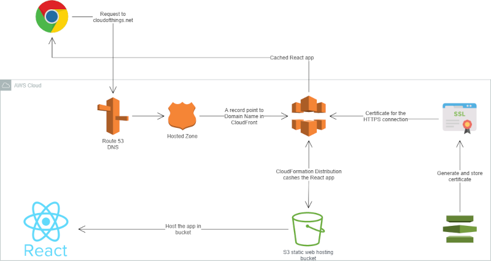
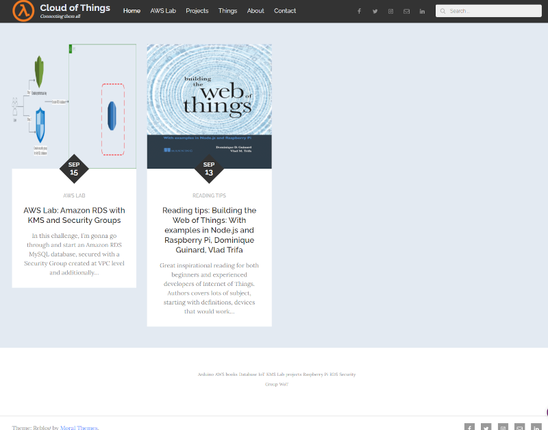

<br />
<p align="center">
  <a href="https://github.com/CloudedThings/100-Days-in-Cloud">
    
  </a>

  <h3 align="center">100 days in Cloud</h3>

  <p align="center">
    React App on S3 with Static Hosting and CloudFront
    <br />
    Lab 94
    <br />
  </p>
</p>

<details open="open">
  <summary><h2 style="display: inline-block">Lab Details</h2></summary>
  <ol>
    <li><a href="#services-covered">Services covered</a>
    <li><a href="#lab-description">Lab description</a></li>
    </li>
    <li><a href="#lab-date">Lab date</a></li>
    <li><a href="#prerequisites">Prerequisites</a></li>    
    <li><a href="#lab-steps">Lab steps</a></li>
    <li><a href="#lab-files">Lab files</a></li>
    <li><a href="#acknowledgements">Acknowledgements</a></li>
  </ol>
</details>

---

## Services Covered
* **S3**
* **Route 53**
* **IAM Role**
* **CloudFront**
* **Certificate Manager**

---

## Lab description
Purpose of this lab is to create an React app hosted in S3 bucket that'll be a static website for cloudofthings.net. To improve the accesibility and get better performance the website will be distributed by CloudFormation.
* **Creating and hosting static website in S3**
* **Creating simple React website**
* **Creating records in Route 53**
* **Creating CloudFront distribution**
* **Creating HTTPS certificates and routing traffic**

---

### **Go visit cloudofthings.net**

---
<a href="https://cloudofthings.net">

</a>

---

### Lab date
28-09-2021

---

### Prerequisites
* AWS account
* npm installed - [download](https://nodejs.org/en/download/)
* A registered domain for the second part

---

### Lab source
[Be A Better Dev](https://www.youtube.com/watch?v=mls8tiiI3uc)

---

### Lab steps

1. In the working folder run command that will create a React app
```
  npx create-react-app demo-app
```
This will download and create app called *demo-app* in your working directory.
1. Go into the demo-app fodler and run
```
  npm start
```
This will start environment and open the app in your browser.

3. Next build the app
```
  npm run build
```
It will batch everything upp.
4. Create a bucket for hosting the app. Upload files from the build folder inside the *demo-app* folder. In permissions turn off the **block public access**, and change the policy that it'll allow anyone to get objects from the bucket:
```
{
    "Version": "2012-10-17",
    "Statement": [
        {
            "Sid": "PublicReadGetObject",
            "Effect": "Allow",
            "Principal": "*",
            "Action": "s3:GetObject",
            "Resource": "arn:aws:s3:::www.awsimplified.lab/*"
        }
    ]
}
```
You might need a policy granting you user \*allow\* effects for some actions:
```
{
    "Version": "2012-10-17",
    "Statement": [
        {
            "Sid": "ModifyBucketPolicy",
            "Action": [
                "s3:GetBucketPolicy",
                "s3:PutBucketPolicy"
            ],
            "Effect": "Allow",
            "Resource": "arn:aws:s3:::*"
        },
        {
            "Sid": "AccessS3Console",
            "Action": [
                "s3:GetBucketLocation",
                "s3:ListAllMyBuckets"
            ],
            "Effect": "Allow",
            "Resource": "arn:aws:s3:::*"
        }
    ]
}
```

It might be needed even if you use an user with **AdministratorAccess** policy attached to it. And disable the **Block Public Access settings for this account** because this has higher priority then any other policicies.

5. In properties change the **static website hosting** to enabled.

6. In Route 53 go to the hosted zones (this is assuming that you have a registered domain in Route 53). Then create a new records as a _Simple routing_ and define simple record, record type as _A to IPv4 and AWS resources_ and _Value/Route traffic to_ as _Alias to S3 website endpoint_, choose the right region and your website hosting bucket.

---

Next part is the deployment of the app in the CloudFront. 
1. In Certificate Manager request a public certificate for the domain address.
Validate the certificate (either DNS, simpler and integrated in Route53 or email), this might take a while.
2. Go to CloudFront and create distribution. As _Origin domain_ you need to copy in the address from S3.Don't use the auto-fill option, those are incorrect. You'll find that address in the **Static website hosting** section of your bucket. When in S3 edit the _Protocol_ to **https**. 
In order to support HTTPS change the _Viewer protocol policy_ to **Redirect HTTP to HTTPS**. Under __Custom SSL certificate_ choose the earlier created certificate in AWS Certificate Manager.
3. In Route 53 update the _A records_ that they point to the adresses provided in Cloud Front so _Route traffic to_ **Alias to CloudFront distribution** and paste the adress you see under CloudFront distribution **Domain name**.

### Here is the website :
:page_facing_up:
[cloudofthings.net](https://cloudofthings.net "CloudOfThings.net")

---
 
### Lab files
* s3bucket_policy.json - policy for the bucket

---

### Acknowledgements
* [Be A Better Dev](https://www.youtube.com/watch?v=mls8tiiI3uc)