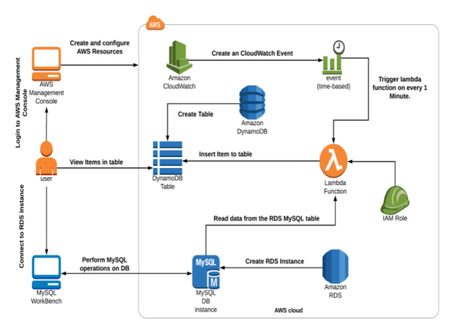
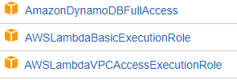
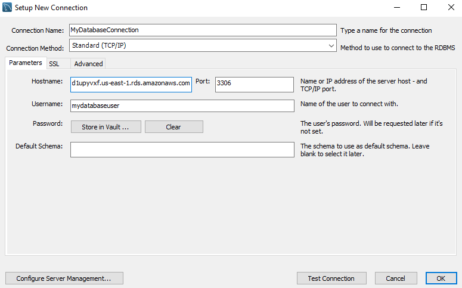

<br />
<p align="center">
  <a href="https://github.com/CloudedThings/100-Days-in-Cloud">
    
  </a>

  <h3 align="center">100 days in Cloud</h3>

  <p align="center">
    CloudWatch event for RDS backup to DynamoDB
    <br />
    Lab 95
    <br />
  </p>
</p>

<details open="open">
  <summary><h2 style="display: inline-block">Lab Details</h2></summary>
  <ol>
    <li><a href="#services-covered">Services covered</a>
    <li><a href="#lab-description">Lab description</a></li>
    </li>
    <li><a href="#lab-date">Lab date</a></li>
    <li><a href="#prerequisites">Prerequisites</a></li>    
    <li><a href="#lab-steps">Lab steps</a></li>
    <li><a href="#lab-files">Lab files</a></li>
    <li><a href="#acknowledgements">Acknowledgements</a></li>
  </ol>
</details>

## Services Covered
* **RDS MySQL database**
* **Security Group for RDS**
* **IAM Role**
* **CloudWatch Events**
* **Lambda**

## Lab description
Purpose of this lab is to create an CloudWatch Event Rule that will trigger the Lambda function on a schedule. Lambdas code will querry RDS MySQL database and will backup found entries into DynamoDB table. MySQL Workbench will be used for connection and querring the RDS database. 
* **Creating RDS MySQL database**
* **Creating Security Group for RDS**
* **Creating Role in IAM**
* **CloudWatch Events**
* **Creating and uploding Lambda code**


### Lab date
27-09-2021

### Prerequisites
* AWS account
* MySQL Workbench for testing [download](https://dev.mysql.com/downloads/workbench/)

### Lab source
[Whizlabs.com](https://play.whizlabs.com/site/task_details?lab_type=1&task_id=183&quest_id=36)

### Lab steps
1. In EC2 start with creating a Security Group for Amazon RDS database. Allow ingress traffic for type \*MySQL/Aurora\* from everywhere.
1. Create a Role in IAM, choose \*Lambda\* as \*trusted entity\*. Attach following policies:

2. Create a table in DynamoDB, give it a name, set a partition key.
3. Create a database in RDS. Choose \*Standard create\*, \*MySQL\* as engine, **Free tier** as template, create user and password. As instance type choose **db.t2.micro**, grant it public access and assign the earlier created Security Group, rest leave as default. Under \*Additional Configurations\* give your database a name, and uncheck the \*Enable automated backups\*, leave rest as default.
4. When the database becomes **Available** you can connect to the DB instance. I used MySQL Workbench. Get the endpoint and port form **Connectivity & security** fill in database details. In Workbench:

5. When connected paste the following MySQL command that will create a StudentDB with three values with three fields:

```
CREATE DATABASE StudentDB;

Use StudentDB;

CREATE TABLE students (

studentId INT AUTO_INCREMENT,

studentName VARCHAR(50) NOT NULL,

Course VARCHAR(55),Semester VARCHAR(50) NOT NULL,PRIMARY KEY (studentId));

INSERT INTO students(studentName, Course, Semester) VALUES ('Paul', 'MBA', 'Second');

INSERT INTO students(studentName, Course, Semester) VALUES ('John', 'IT', 'Third');

INSERT INTO students(studentName, Course, Semester) VALUES ('Sebastian', 'Medicine', 'fifth');

SELECT * FROM students;
```

6. Create [Lambda](https://github.com/CloudedThings/100-Days-in-Cloud/blob/main/Labs/95%20-%20CloudWatch%20event%20for%20RDS%20backup%20to%20DynamoDB/lambda_function.py) function, in Python and attach earlier created Role. Upload the zip file and change values for your database, user and DynamoDB in the code.
7. Create a CloudWach Event and choose *scheduled* every minute and Lambda as a trigger. This will call Lambda function and create backup into DynamoDB table.
8. Efter at least one minute you should see that those first three values should be populated in table by Lambda function. You can run additional MySQL querries to add more values and they will eventually get copied to the table. To see the items you need to choose the created table then **Items summary** -> **View items** -> **Run**.
9. Delete all the created resources to avoid any extra costs.


 
### Lab files
* [lambda_function.py](https://github.com/CloudedThings/100-Days-in-Cloud/blob/main/Labs/95%20-%20CloudWatch%20event%20for%20RDS%20backup%20to%20DynamoDB/lambda_function.py) - Lambda function triggered by CloudWatch Event, querries the RDS database and copies values into DynamoDB table

### Acknowledgements
* [whizlabs.com](https://www.whizlabs.com/)
